```r
library(tidyverse)     # for graphing and data cleaning
library(gardenR)       # for Lisa's garden data
library(lubridate)     # for date manipulation
library(ggthemes)      # for even more plotting themes
library(geofacet)      # for special faceting with US map layout
theme_set(theme_minimal())       # My favorite ggplot() theme :)
```


```r
# Lisa's garden data
data("garden_harvest")

# Seeds/plants (and other garden supply) costs
data("garden_spending")

# Planting dates and locations
data("garden_planting")

# Tidy Tuesday data
kids <- readr::read_csv('https://raw.githubusercontent.com/rfordatascience/tidytuesday/master/data/2020/2020-09-15/kids.csv')
```

## Setting up on GitHub!

Before starting your assignment, you need to get yourself set up on GitHub and make sure GitHub is connected to R Studio. To do that, you should read the instruction (through the "Cloning a repo" section) and watch the video [here](https://github.com/llendway/github_for_collaboration/blob/master/github_for_collaboration.md). Then, do the following (if you get stuck on a step, don't worry, I will help! You can always get started on the homework and we can figure out the GitHub piece later):

* Create a repository on GitHub, giving it a nice name so you know it is for the 3rd weekly exercise assignment (follow the instructions in the document/video).  
* Copy the repo name so you can clone it to your computer. In R Studio, go to file --> New project --> Version control --> Git and follow the instructions from the document/video.  
* Download the code from this document and save it in the repository folder/project on your computer.  
* In R Studio, you should then see the .Rmd file in the upper right corner in the Git tab (along with the .Rproj file and probably .gitignore).  
* Check all the boxes of the files in the Git tab and choose commit.  
* In the commit window, write a commit message, something like "Initial upload" would be appropriate, and commit the files.  
* Either click the green up arrow in the commit window or close the commit window and click the green up arrow in the Git tab to push your changes to GitHub.  
* Refresh your GitHub page (online) and make sure the new documents have been pushed out.  
* Back in R Studio, knit the .Rmd file. When you do that, you should have two (as long as you didn't make any changes to the .Rmd file, in which case you might have three) files show up in the Git tab - an .html file and an .md file. The .md file is something we haven't seen before and is here because I included `keep_md: TRUE` in the YAML heading. The .md file is a markdown (NOT R Markdown) file that is an interim step to creating the html file. They are displayed fairly nicely in GitHub, so we want to keep it and look at it there. Click the boxes next to these two files, commit changes (remember to include a commit message), and push them (green up arrow).  
* As you work through your homework, save and commit often, push changes occasionally (maybe after you feel finished with an exercise?), and go check to see what the .md file looks like on GitHub.  
* If you have issues, let me know! This is new to many of you and may not be intuitive at first. But, I promise, you'll get the hang of it! 


## Instructions

* Put your name at the top of the document. 

* **For ALL graphs, you should include appropriate labels.** 

* Feel free to change the default theme, which I currently have set to `theme_minimal()`. 

* Use good coding practice. Read the short sections on good code with [pipes](https://style.tidyverse.org/pipes.html) and [ggplot2](https://style.tidyverse.org/ggplot2.html). **This is part of your grade!**

* When you are finished with ALL the exercises, uncomment the options at the top so your document looks nicer. Don't do it before then, or else you might miss some important warnings and messages.


## Warm-up exercises with garden data

These exercises will reiterate what you learned in the "Expanding the data wrangling toolkit" tutorial. If you haven't gone through the tutorial yet, you should do that first.

  1. Summarize the `garden_harvest` data to find the total harvest weight in pounds for each vegetable and day of week (HINT: use the `wday()` function from `lubridate`). Display the results so that the vegetables are rows but the days of the week are columns.


```r
garden_harvest %>% 
  mutate(day_of_week = wday(date, label = TRUE)) %>% 
  group_by(vegetable, day_of_week) %>% 
  summarize(total_weight_lb = sum(weight*0.0022)) %>% 
  arrange(day_of_week, vegetable) %>% 
  pivot_wider(names_from = day_of_week,
              values_from = total_weight_lb)
```

<div data-pagedtable="false">
  <script data-pagedtable-source type="application/json">
{"columns":[{"label":["vegetable"],"name":[1],"type":["chr"],"align":["left"]},{"label":["Sun"],"name":[2],"type":["dbl"],"align":["right"]},{"label":["Mon"],"name":[3],"type":["dbl"],"align":["right"]},{"label":["Tue"],"name":[4],"type":["dbl"],"align":["right"]},{"label":["Wed"],"name":[5],"type":["dbl"],"align":["right"]},{"label":["Thu"],"name":[6],"type":["dbl"],"align":["right"]},{"label":["Fri"],"name":[7],"type":["dbl"],"align":["right"]},{"label":["Sat"],"name":[8],"type":["dbl"],"align":["right"]}],"data":[{"1":"beans","2":"1.9096","3":"6.4944","4":"4.3780","5":"4.0744","6":"3.3858","7":"1.5224","8":"4.6992"},{"1":"beets","2":"0.3212","3":"0.6710","4":"0.1584","5":"0.1826","6":"11.8668","7":"0.0242","8":"0.3784"},{"1":"broccoli","2":"1.2562","3":"0.8184","4":"NA","5":"0.7062","6":"NA","7":"0.1650","8":"NA"},{"1":"carrots","2":"2.9304","3":"0.8690","4":"0.3520","5":"5.5506","6":"2.6686","7":"2.1340","8":"2.3254"},{"1":"corn","2":"1.4542","3":"0.7568","4":"0.7260","5":"5.2910","6":"NA","7":"3.4408","8":"1.3134"},{"1":"cucumbers","2":"3.0976","3":"4.7652","4":"10.0254","5":"5.2954","6":"3.3000","7":"7.4140","8":"9.6206"},{"1":"jalapeño","2":"0.2618","3":"5.5418","4":"0.5478","5":"0.4796","6":"0.2244","7":"1.2914","8":"1.5048"},{"1":"kale","2":"0.8250","3":"2.0636","4":"0.2816","5":"0.6160","6":"0.2794","7":"0.3806","8":"1.4872"},{"1":"lettuce","2":"1.4630","3":"2.4530","4":"0.9152","5":"1.1836","6":"2.4464","7":"1.7974","8":"1.3134"},{"1":"onions","2":"0.2596","3":"0.5082","4":"0.7062","5":"NA","6":"0.6006","7":"0.0726","8":"1.9096"},{"1":"peas","2":"2.0526","3":"4.6244","4":"2.0636","5":"1.0780","6":"3.3902","7":"0.9350","8":"2.8468"},{"1":"peppers","2":"0.5016","3":"2.5212","4":"1.4410","5":"2.4376","6":"0.7084","7":"0.3344","8":"1.3794"},{"1":"radish","2":"0.0814","3":"0.1958","4":"0.0946","5":"NA","6":"0.1474","7":"0.1936","8":"0.2310"},{"1":"rutabaga","2":"19.2236","3":"NA","4":"NA","5":"NA","6":"NA","7":"3.5706","8":"6.8838"},{"1":"spinach","2":"0.4862","3":"0.1474","4":"0.4950","5":"0.2134","6":"0.2332","7":"0.1958","8":"0.2596"},{"1":"strawberries","2":"0.0814","3":"0.4774","4":"NA","5":"NA","6":"0.0880","7":"0.4862","8":"0.1694"},{"1":"Swiss chard","2":"1.2452","3":"1.0714","4":"0.0704","5":"0.9064","6":"2.2264","7":"0.6160","8":"0.7326"},{"1":"tomatoes","2":"75.4512","3":"11.4686","4":"48.6486","5":"58.1438","6":"34.4454","7":"84.8980","8":"35.0526"},{"1":"zucchini","2":"12.2100","3":"12.1704","4":"16.4340","5":"2.0372","6":"34.5576","7":"18.6824","8":"3.4078"},{"1":"basil","2":"NA","3":"0.0660","4":"0.1100","5":"NA","6":"0.0264","7":"0.4664","8":"0.4092"},{"1":"hot peppers","2":"NA","3":"1.2562","4":"0.1408","5":"0.0682","6":"NA","7":"NA","8":"NA"},{"1":"potatoes","2":"NA","3":"0.9680","4":"NA","5":"4.5606","6":"11.8272","7":"3.7334","8":"2.7962"},{"1":"pumpkins","2":"NA","3":"30.0564","4":"31.7900","5":"NA","6":"NA","7":"NA","8":"92.4946"},{"1":"raspberries","2":"NA","3":"0.1298","4":"0.3344","5":"NA","6":"0.2882","7":"0.5698","8":"0.5324"},{"1":"squash","2":"NA","3":"24.2836","4":"18.4294","5":"NA","6":"NA","7":"NA","8":"56.1044"},{"1":"cilantro","2":"NA","3":"NA","4":"0.0044","5":"NA","6":"NA","7":"0.0726","8":"0.0374"},{"1":"edamame","2":"NA","3":"NA","4":"1.3992","5":"NA","6":"NA","7":"NA","8":"4.6794"},{"1":"chives","2":"NA","3":"NA","4":"NA","5":"0.0176","6":"NA","7":"NA","8":"NA"},{"1":"kohlrabi","2":"NA","3":"NA","4":"NA","5":"NA","6":"0.4202","7":"NA","8":"NA"},{"1":"apple","2":"NA","3":"NA","4":"NA","5":"NA","6":"NA","7":"NA","8":"0.3432"},{"1":"asparagus","2":"NA","3":"NA","4":"NA","5":"NA","6":"NA","7":"NA","8":"0.0440"}],"options":{"columns":{"min":{},"max":[10]},"rows":{"min":[10],"max":[10]},"pages":{}}}
  </script>
</div>

  2. Summarize the `garden_harvest` data to find the total harvest in pound for each vegetable variety and then try adding the plot from the `garden_planting` table. This will not turn out perfectly. What is the problem? How might you fix it?


```r
garden_harvest %>% 
  group_by(vegetable, variety) %>% 
  summarize(tot_harvest_lb = sum(weight*0.0022)) %>% 
  left_join(garden_planting,
            by = c("vegetable", "variety"))
```

<div data-pagedtable="false">
  <script data-pagedtable-source type="application/json">
{"columns":[{"label":["vegetable"],"name":[1],"type":["chr"],"align":["left"]},{"label":["variety"],"name":[2],"type":["chr"],"align":["left"]},{"label":["tot_harvest_lb"],"name":[3],"type":["dbl"],"align":["right"]},{"label":["plot"],"name":[4],"type":["chr"],"align":["left"]},{"label":["number_seeds_planted"],"name":[5],"type":["dbl"],"align":["right"]},{"label":["date"],"name":[6],"type":["date"],"align":["right"]},{"label":["number_seeds_exact"],"name":[7],"type":["lgl"],"align":["right"]},{"label":["notes"],"name":[8],"type":["chr"],"align":["left"]}],"data":[{"1":"apple","2":"unknown","3":"0.3432","4":"NA","5":"NA","6":"<NA>","7":"NA","8":"NA"},{"1":"asparagus","2":"asparagus","3":"0.0440","4":"NA","5":"NA","6":"<NA>","7":"NA","8":"NA"},{"1":"basil","2":"Isle of Naxos","3":"1.0780","4":"potB","5":"40","6":"2020-05-16","7":"FALSE","8":"NA"},{"1":"beans","2":"Bush Bush Slender","3":"22.0836","4":"M","5":"30","6":"2020-05-16","7":"FALSE","8":"NA"},{"1":"beans","2":"Bush Bush Slender","3":"22.0836","4":"D","5":"10","6":"2020-05-21","7":"TRUE","8":"NA"},{"1":"beans","2":"Chinese Red Noodle","3":"0.7832","4":"K","5":"5","6":"2020-05-25","7":"TRUE","8":"NA"},{"1":"beans","2":"Chinese Red Noodle","3":"0.7832","4":"L","5":"5","6":"2020-05-25","7":"TRUE","8":"NA"},{"1":"beans","2":"Classic Slenderette","3":"3.5970","4":"E","5":"29","6":"2020-06-20","7":"TRUE","8":"NA"},{"1":"beets","2":"Gourmet Golden","3":"7.0070","4":"H","5":"40","6":"2020-05-02","7":"FALSE","8":"NA"},{"1":"beets","2":"leaves","3":"0.2222","4":"NA","5":"NA","6":"<NA>","7":"NA","8":"NA"},{"1":"beets","2":"Sweet Merlin","3":"6.3734","4":"H","5":"40","6":"2020-05-02","7":"FALSE","8":"NA"},{"1":"broccoli","2":"Main Crop Bravado","3":"2.1274","4":"D","5":"7","6":"2020-05-22","7":"TRUE","8":"NA"},{"1":"broccoli","2":"Main Crop Bravado","3":"2.1274","4":"I","5":"7","6":"2020-05-22","7":"TRUE","8":"NA"},{"1":"broccoli","2":"Yod Fah","3":"0.8184","4":"P","5":"25","6":"2020-05-16","7":"FALSE","8":"NA"},{"1":"carrots","2":"Bolero","3":"8.2742","4":"H","5":"50","6":"2020-05-02","7":"FALSE","8":"NA"},{"1":"carrots","2":"Bolero","3":"8.2742","4":"L","5":"50","6":"2020-05-25","7":"FALSE","8":"NA"},{"1":"carrots","2":"Dragon","3":"4.0964","4":"H","5":"40","6":"2020-05-02","7":"FALSE","8":"NA"},{"1":"carrots","2":"Dragon","3":"4.0964","4":"L","5":"50","6":"2020-05-25","7":"FALSE","8":"NA"},{"1":"carrots","2":"greens","3":"0.3718","4":"NA","5":"NA","6":"<NA>","7":"NA","8":"NA"},{"1":"carrots","2":"King Midas","3":"4.0876","4":"H","5":"50","6":"2020-05-02","7":"FALSE","8":"NA"},{"1":"carrots","2":"King Midas","3":"4.0876","4":"L","5":"50","6":"2020-05-25","7":"FALSE","8":"NA"},{"1":"chives","2":"perrenial","3":"0.0176","4":"NA","5":"NA","6":"<NA>","7":"NA","8":"NA"},{"1":"cilantro","2":"cilantro","3":"0.1144","4":"potD","5":"15","6":"2020-05-16","7":"FALSE","8":"NA"},{"1":"cilantro","2":"cilantro","3":"0.1144","4":"E","5":"20","6":"2020-06-20","7":"FALSE","8":"NA"},{"1":"corn","2":"Dorinny Sweet","3":"11.3828","4":"A","5":"20","6":"2020-05-25","7":"FALSE","8":"NA"},{"1":"corn","2":"Golden Bantam","3":"1.5994","4":"B","5":"20","6":"2020-05-25","7":"FALSE","8":"NA"},{"1":"cucumbers","2":"pickling","3":"43.5182","4":"L","5":"20","6":"2020-05-25","7":"FALSE","8":"NA"},{"1":"edamame","2":"edamame","3":"6.0786","4":"O","5":"25","6":"2020-05-16","7":"FALSE","8":"NA"},{"1":"hot peppers","2":"thai","3":"0.1474","4":"potB","5":"1","6":"2020-05-21","7":"TRUE","8":"NA"},{"1":"hot peppers","2":"variety","3":"1.3178","4":"potC","5":"6","6":"2020-05-21","7":"TRUE","8":"NA"},{"1":"jalapeño","2":"giant","3":"9.8516","4":"L","5":"4","6":"2020-05-21","7":"TRUE","8":"NA"},{"1":"kale","2":"Heirloom Lacinto","3":"5.9334","4":"P","5":"30","6":"2020-05-02","7":"FALSE","8":"NA"},{"1":"kale","2":"Heirloom Lacinto","3":"5.9334","4":"front","5":"30","6":"2020-06-20","7":"FALSE","8":"NA"},{"1":"kohlrabi","2":"Crispy Colors Duo","3":"0.4202","4":"front","5":"10","6":"2020-05-20","7":"FALSE","8":"NA"},{"1":"lettuce","2":"Farmer's Market Blend","3":"3.7950","4":"C","5":"60","6":"2020-05-02","7":"FALSE","8":"NA"},{"1":"lettuce","2":"Farmer's Market Blend","3":"3.7950","4":"L","5":"60","6":"2020-05-16","7":"FALSE","8":"NA"},{"1":"lettuce","2":"Lettuce Mixture","3":"4.7388","4":"G","5":"200","6":"2020-06-20","7":"FALSE","8":"NA"},{"1":"lettuce","2":"mustard greens","3":"0.0506","4":"NA","5":"NA","6":"<NA>","7":"NA","8":"NA"},{"1":"lettuce","2":"reseed","3":"0.0990","4":"NA","5":"NA","6":"<NA>","7":"NA","8":"NA"},{"1":"lettuce","2":"Tatsoi","3":"2.8886","4":"P","5":"25","6":"2020-05-02","7":"FALSE","8":"NA"},{"1":"onions","2":"Delicious Duo","3":"0.7524","4":"P","5":"25","6":"2020-04-26","7":"FALSE","8":"NA"},{"1":"onions","2":"Long Keeping Rainbow","3":"3.3044","4":"H","5":"40","6":"2020-04-26","7":"FALSE","8":"NA"},{"1":"peas","2":"Magnolia Blossom","3":"7.4426","4":"B","5":"24","6":"2020-04-19","7":"TRUE","8":"NA"},{"1":"peas","2":"Super Sugar Snap","3":"9.5480","4":"A","5":"22","6":"2020-04-19","7":"TRUE","8":"NA"},{"1":"peppers","2":"green","3":"5.6804","4":"K","5":"12","6":"2020-05-21","7":"TRUE","8":"NA"},{"1":"peppers","2":"green","3":"5.6804","4":"O","5":"5","6":"2020-05-21","7":"TRUE","8":"NA"},{"1":"peppers","2":"variety","3":"3.6432","4":"potA","5":"3","6":"2020-05-21","7":"TRUE","8":"NA"},{"1":"peppers","2":"variety","3":"3.6432","4":"potA","5":"3","6":"2020-05-21","7":"TRUE","8":"NA"},{"1":"peppers","2":"variety","3":"3.6432","4":"potD","5":"1","6":"2020-05-21","7":"TRUE","8":"NA"},{"1":"potatoes","2":"purple","3":"3.0030","4":"D","5":"5","6":"2020-05-02","7":"FALSE","8":"NA"},{"1":"potatoes","2":"red","3":"4.4242","4":"I","5":"3","6":"2020-05-22","7":"FALSE","8":"NA"},{"1":"potatoes","2":"Russet","3":"9.0728","4":"D","5":"8","6":"2020-05-02","7":"FALSE","8":"NA"},{"1":"potatoes","2":"yellow","3":"7.3854","4":"I","5":"10","6":"2020-05-02","7":"FALSE","8":"NA"},{"1":"potatoes","2":"yellow","3":"7.3854","4":"I","5":"8","6":"2020-05-22","7":"TRUE","8":"NA"},{"1":"pumpkins","2":"Cinderella's Carraige","3":"32.8042","4":"B","5":"3","6":"2020-05-20","7":"TRUE","8":"NA"},{"1":"pumpkins","2":"New England Sugar","3":"44.7656","4":"K","5":"4","6":"2020-05-25","7":"TRUE","8":"NA"},{"1":"pumpkins","2":"saved","3":"76.7712","4":"B","5":"8","6":"2020-05-20","7":"TRUE","8":"NA"},{"1":"radish","2":"Garden Party Mix","3":"0.9438","4":"C","5":"20","6":"2020-05-02","7":"FALSE","8":"NA"},{"1":"radish","2":"Garden Party Mix","3":"0.9438","4":"G","5":"30","6":"2020-05-02","7":"FALSE","8":"NA"},{"1":"radish","2":"Garden Party Mix","3":"0.9438","4":"H","5":"15","6":"2020-05-02","7":"FALSE","8":"NA"},{"1":"raspberries","2":"perrenial","3":"1.8546","4":"NA","5":"NA","6":"<NA>","7":"NA","8":"NA"},{"1":"rutabaga","2":"Improved Helenor","3":"29.6780","4":"NA","5":"NA","6":"<NA>","7":"NA","8":"NA"},{"1":"spinach","2":"Catalina","3":"2.0306","4":"H","5":"50","6":"2020-05-16","7":"FALSE","8":"NA"},{"1":"spinach","2":"Catalina","3":"2.0306","4":"E","5":"100","6":"2020-06-20","7":"FALSE","8":"NA"},{"1":"squash","2":"Blue (saved)","3":"41.4370","4":"A","5":"4","6":"2020-05-20","7":"TRUE","8":"NA"},{"1":"squash","2":"Blue (saved)","3":"41.4370","4":"B","5":"8","6":"2020-05-20","7":"TRUE","8":"NA"},{"1":"squash","2":"delicata","3":"10.4764","4":"K","5":"8","6":"2020-05-25","7":"TRUE","8":"NA"},{"1":"squash","2":"Red Kuri","3":"22.6842","4":"A","5":"4","6":"2020-05-20","7":"TRUE","8":"NA"},{"1":"squash","2":"Red Kuri","3":"22.6842","4":"B","5":"4","6":"2020-05-20","7":"TRUE","8":"NA"},{"1":"squash","2":"Red Kuri","3":"22.6842","4":"side","5":"1","6":"2020-05-20","7":"TRUE","8":"NA"},{"1":"squash","2":"Waltham Butternut","3":"24.2198","4":"A","5":"4","6":"2020-05-20","7":"TRUE","8":"NA"},{"1":"squash","2":"Waltham Butternut","3":"24.2198","4":"K","5":"6","6":"2020-05-25","7":"TRUE","8":"NA"},{"1":"strawberries","2":"perrenial","3":"1.3024","4":"NA","5":"NA","6":"<NA>","7":"NA","8":"NA"},{"1":"Swiss chard","2":"Neon Glow","3":"6.8684","4":"M","5":"25","6":"2020-05-02","7":"FALSE","8":"NA"},{"1":"tomatoes","2":"Amish Paste","3":"65.5358","4":"J","5":"1","6":"2020-05-20","7":"TRUE","8":"NA"},{"1":"tomatoes","2":"Amish Paste","3":"65.5358","4":"N","5":"2","6":"2020-05-20","7":"TRUE","8":"NA"},{"1":"tomatoes","2":"Better Boy","3":"33.9372","4":"J","5":"1","6":"2020-05-20","7":"TRUE","8":"NA"},{"1":"tomatoes","2":"Better Boy","3":"33.9372","4":"N","5":"1","6":"2020-05-20","7":"TRUE","8":"NA"},{"1":"tomatoes","2":"Big Beef","3":"24.9414","4":"N","5":"1","6":"2020-05-20","7":"TRUE","8":"NA"},{"1":"tomatoes","2":"Black Krim","3":"15.7740","4":"N","5":"1","6":"2020-05-20","7":"TRUE","8":"NA"},{"1":"tomatoes","2":"Bonny Best","3":"24.8710","4":"J","5":"1","6":"2020-05-20","7":"TRUE","8":"NA"},{"1":"tomatoes","2":"Brandywine","3":"15.6134","4":"J","5":"1","6":"2020-05-20","7":"TRUE","8":"NA"},{"1":"tomatoes","2":"Cherokee Purple","3":"15.6794","4":"J","5":"1","6":"2020-05-20","7":"TRUE","8":"NA"},{"1":"tomatoes","2":"grape","3":"32.3268","4":"O","5":"1","6":"2020-05-20","7":"TRUE","8":"NA"},{"1":"tomatoes","2":"Jet Star","3":"14.9930","4":"N","5":"1","6":"2020-05-20","7":"TRUE","8":"NA"},{"1":"tomatoes","2":"Mortgage Lifter","3":"26.2702","4":"J","5":"1","6":"2020-05-20","7":"TRUE","8":"died"},{"1":"tomatoes","2":"Mortgage Lifter","3":"26.2702","4":"N","5":"1","6":"2020-05-20","7":"TRUE","8":"NA"},{"1":"tomatoes","2":"Old German","3":"26.6618","4":"J","5":"1","6":"2020-05-20","7":"TRUE","8":"NA"},{"1":"tomatoes","2":"volunteers","3":"51.5042","4":"N","5":"1","6":"2020-06-03","7":"TRUE","8":"NA"},{"1":"tomatoes","2":"volunteers","3":"51.5042","4":"J","5":"1","6":"2020-06-03","7":"TRUE","8":"NA"},{"1":"tomatoes","2":"volunteers","3":"51.5042","4":"front","5":"5","6":"2020-06-03","7":"TRUE","8":"NA"},{"1":"tomatoes","2":"volunteers","3":"51.5042","4":"O","5":"2","6":"2020-06-03","7":"TRUE","8":"NA"},{"1":"zucchini","2":"Romanesco","3":"99.4994","4":"D","5":"3","6":"2020-05-21","7":"TRUE","8":"NA"}],"options":{"columns":{"min":{},"max":[10]},"rows":{"min":[10],"max":[10]},"pages":{}}}
  </script>
</div>

  3. I would like to understand how much money I "saved" by gardening, for each vegetable type. Describe how I could use the `garden_harvest` and `garden_spending` datasets, along with data from somewhere like [this](https://products.wholefoodsmarket.com/search?sort=relevance&store=10542) to answer this question. You can answer this in words, referencing various join functions. You don't need R code but could provide some if it's helpful.

**I would inner_join the prices after tax and vegetable variety variables of both datasets. In this case, it will help me compare the prices of the vegetable variety that you planted versus their price in the market.**

  4. Subset the data to tomatoes. Reorder the tomato varieties from smallest to largest first harvest date. Create a barplot of total harvest in pounds for each variety, in the new order.


```r
garden_harvest %>% 
  filter(vegetable == "tomatoes") %>% 
  mutate(variety = fct_reorder(variety, date, min)) %>% 
  group_by(variety) %>% 
  summarize(tot_harvest_lb = sum(weight)*0.0022, 
            min_date = min(date)) %>%
  ggplot(aes(x = tot_harvest_lb, y = variety))+
  geom_col()
```

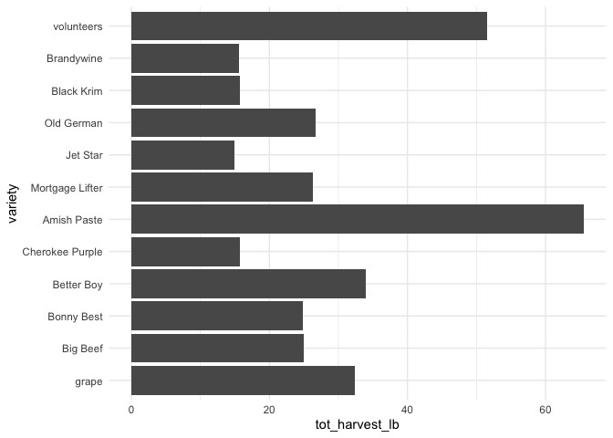<!-- -->

  5. In the `garden_harvest` data, create two new variables: one that makes the varieties lowercase and another that finds the length of the variety name. Arrange the data by vegetable and length of variety name (smallest to largest), with one row for each vegetable variety. HINT: use `str_to_lower()`, `str_length()`, and `distinct()`.
  

```r
garden_harvest %>% 
  mutate(name_lower = str_to_lower(variety)) %>% 
  mutate(name_length = str_length(variety)) %>% 
  distinct(vegetable, variety, .keep_all = TRUE) %>% 
  arrange(vegetable, name_length)
```

<div data-pagedtable="false">
  <script data-pagedtable-source type="application/json">
{"columns":[{"label":["vegetable"],"name":[1],"type":["chr"],"align":["left"]},{"label":["variety"],"name":[2],"type":["chr"],"align":["left"]},{"label":["date"],"name":[3],"type":["date"],"align":["right"]},{"label":["weight"],"name":[4],"type":["dbl"],"align":["right"]},{"label":["units"],"name":[5],"type":["chr"],"align":["left"]},{"label":["name_lower"],"name":[6],"type":["chr"],"align":["left"]},{"label":["name_length"],"name":[7],"type":["int"],"align":["right"]}],"data":[{"1":"apple","2":"unknown","3":"2020-09-26","4":"156","5":"grams","6":"unknown","7":"7"},{"1":"asparagus","2":"asparagus","3":"2020-06-20","4":"20","5":"grams","6":"asparagus","7":"9"},{"1":"basil","2":"Isle of Naxos","3":"2020-06-23","4":"5","5":"grams","6":"isle of naxos","7":"13"},{"1":"beans","2":"Bush Bush Slender","3":"2020-07-06","4":"235","5":"grams","6":"bush bush slender","7":"17"},{"1":"beans","2":"Chinese Red Noodle","3":"2020-08-08","4":"108","5":"grams","6":"chinese red noodle","7":"18"},{"1":"beans","2":"Classic Slenderette","3":"2020-08-05","4":"41","5":"grams","6":"classic slenderette","7":"19"},{"1":"beets","2":"leaves","3":"2020-06-11","4":"8","5":"grams","6":"leaves","7":"6"},{"1":"beets","2":"Sweet Merlin","3":"2020-07-07","4":"10","5":"grams","6":"sweet merlin","7":"12"},{"1":"beets","2":"Gourmet Golden","3":"2020-07-07","4":"62","5":"grams","6":"gourmet golden","7":"14"},{"1":"broccoli","2":"Yod Fah","3":"2020-07-27","4":"372","5":"grams","6":"yod fah","7":"7"},{"1":"broccoli","2":"Main Crop Bravado","3":"2020-09-09","4":"102","5":"grams","6":"main crop bravado","7":"17"},{"1":"carrots","2":"Dragon","3":"2020-07-24","4":"80","5":"grams","6":"dragon","7":"6"},{"1":"carrots","2":"Bolero","3":"2020-07-30","4":"116","5":"grams","6":"bolero","7":"6"},{"1":"carrots","2":"greens","3":"2020-08-29","4":"169","5":"grams","6":"greens","7":"6"},{"1":"carrots","2":"King Midas","3":"2020-07-23","4":"56","5":"grams","6":"king midas","7":"10"},{"1":"chives","2":"perrenial","3":"2020-06-17","4":"8","5":"grams","6":"perrenial","7":"9"},{"1":"cilantro","2":"cilantro","3":"2020-06-23","4":"2","5":"grams","6":"cilantro","7":"8"},{"1":"corn","2":"Dorinny Sweet","3":"2020-08-11","4":"330","5":"grams","6":"dorinny sweet","7":"13"},{"1":"corn","2":"Golden Bantam","3":"2020-08-15","4":"383","5":"grams","6":"golden bantam","7":"13"},{"1":"cucumbers","2":"pickling","3":"2020-07-08","4":"181","5":"grams","6":"pickling","7":"8"},{"1":"edamame","2":"edamame","3":"2020-08-11","4":"109","5":"grams","6":"edamame","7":"7"},{"1":"hot peppers","2":"thai","3":"2020-07-20","4":"12","5":"grams","6":"thai","7":"4"},{"1":"hot peppers","2":"variety","3":"2020-07-20","4":"559","5":"grams","6":"variety","7":"7"},{"1":"jalapeño","2":"giant","3":"2020-07-17","4":"20","5":"grams","6":"giant","7":"5"},{"1":"kale","2":"Heirloom Lacinto","3":"2020-06-13","4":"10","5":"grams","6":"heirloom lacinto","7":"16"},{"1":"kohlrabi","2":"Crispy Colors Duo","3":"2020-09-17","4":"191","5":"grams","6":"crispy colors duo","7":"17"},{"1":"lettuce","2":"reseed","3":"2020-06-06","4":"20","5":"grams","6":"reseed","7":"6"},{"1":"lettuce","2":"Tatsoi","3":"2020-06-20","4":"18","5":"grams","6":"tatsoi","7":"6"},{"1":"lettuce","2":"mustard greens","3":"2020-06-29","4":"23","5":"grams","6":"mustard greens","7":"14"},{"1":"lettuce","2":"Lettuce Mixture","3":"2020-07-22","4":"23","5":"grams","6":"lettuce mixture","7":"15"},{"1":"lettuce","2":"Farmer's Market Blend","3":"2020-06-11","4":"12","5":"grams","6":"farmer's market blend","7":"21"},{"1":"onions","2":"Delicious Duo","3":"2020-07-16","4":"50","5":"grams","6":"delicious duo","7":"13"},{"1":"onions","2":"Long Keeping Rainbow","3":"2020-07-20","4":"102","5":"grams","6":"long keeping rainbow","7":"20"},{"1":"peas","2":"Magnolia Blossom","3":"2020-06-17","4":"8","5":"grams","6":"magnolia blossom","7":"16"},{"1":"peas","2":"Super Sugar Snap","3":"2020-06-17","4":"121","5":"grams","6":"super sugar snap","7":"16"},{"1":"peppers","2":"green","3":"2020-08-04","4":"81","5":"grams","6":"green","7":"5"},{"1":"peppers","2":"variety","3":"2020-07-24","4":"68","5":"grams","6":"variety","7":"7"},{"1":"potatoes","2":"red","3":"2020-10-15","4":"1718","5":"grams","6":"red","7":"3"},{"1":"potatoes","2":"purple","3":"2020-08-06","4":"317","5":"grams","6":"purple","7":"6"},{"1":"potatoes","2":"yellow","3":"2020-08-06","4":"439","5":"grams","6":"yellow","7":"6"},{"1":"potatoes","2":"Russet","3":"2020-09-16","4":"629","5":"grams","6":"russet","7":"6"},{"1":"pumpkins","2":"saved","3":"2020-09-01","4":"4758","5":"grams","6":"saved","7":"5"},{"1":"pumpkins","2":"New England Sugar","3":"2020-09-19","4":"1109","5":"grams","6":"new england sugar","7":"17"},{"1":"pumpkins","2":"Cinderella's Carraige","3":"2020-09-01","4":"7350","5":"grams","6":"cinderella's carraige","7":"21"},{"1":"radish","2":"Garden Party Mix","3":"2020-06-06","4":"36","5":"grams","6":"garden party mix","7":"16"},{"1":"raspberries","2":"perrenial","3":"2020-06-29","4":"30","5":"grams","6":"perrenial","7":"9"},{"1":"rutabaga","2":"Improved Helenor","3":"2020-10-16","4":"883","5":"grams","6":"improved helenor","7":"16"},{"1":"spinach","2":"Catalina","3":"2020-06-11","4":"9","5":"grams","6":"catalina","7":"8"},{"1":"squash","2":"delicata","3":"2020-09-19","4":"307","5":"grams","6":"delicata","7":"8"},{"1":"squash","2":"Red Kuri","3":"2020-09-19","4":"1178","5":"grams","6":"red kuri","7":"8"},{"1":"squash","2":"Blue (saved)","3":"2020-09-01","4":"3227","5":"grams","6":"blue (saved)","7":"12"},{"1":"squash","2":"Waltham Butternut","3":"2020-09-19","4":"1834","5":"grams","6":"waltham butternut","7":"17"},{"1":"strawberries","2":"perrenial","3":"2020-06-18","4":"40","5":"grams","6":"perrenial","7":"9"},{"1":"Swiss chard","2":"Neon Glow","3":"2020-06-21","4":"19","5":"grams","6":"neon glow","7":"9"},{"1":"tomatoes","2":"grape","3":"2020-07-11","4":"24","5":"grams","6":"grape","7":"5"},{"1":"tomatoes","2":"Big Beef","3":"2020-07-21","4":"137","5":"grams","6":"big beef","7":"8"},{"1":"tomatoes","2":"Jet Star","3":"2020-07-28","4":"315","5":"grams","6":"jet star","7":"8"},{"1":"tomatoes","2":"Bonny Best","3":"2020-07-21","4":"339","5":"grams","6":"bonny best","7":"10"},{"1":"tomatoes","2":"Better Boy","3":"2020-07-24","4":"220","5":"grams","6":"better boy","7":"10"},{"1":"tomatoes","2":"Old German","3":"2020-07-28","4":"611","5":"grams","6":"old german","7":"10"},{"1":"tomatoes","2":"Brandywine","3":"2020-08-01","4":"320","5":"grams","6":"brandywine","7":"10"},{"1":"tomatoes","2":"Black Krim","3":"2020-08-01","4":"436","5":"grams","6":"black krim","7":"10"},{"1":"tomatoes","2":"volunteers","3":"2020-08-04","4":"73","5":"grams","6":"volunteers","7":"10"},{"1":"tomatoes","2":"Amish Paste","3":"2020-07-25","4":"463","5":"grams","6":"amish paste","7":"11"},{"1":"tomatoes","2":"Cherokee Purple","3":"2020-07-24","4":"247","5":"grams","6":"cherokee purple","7":"15"},{"1":"tomatoes","2":"Mortgage Lifter","3":"2020-07-27","4":"801","5":"grams","6":"mortgage lifter","7":"15"},{"1":"zucchini","2":"Romanesco","3":"2020-07-06","4":"175","5":"grams","6":"romanesco","7":"9"}],"options":{"columns":{"min":{},"max":[10]},"rows":{"min":[10],"max":[10]},"pages":{}}}
  </script>
</div>

  6. In the `garden_harvest` data, find all distinct vegetable varieties that have "er" or "ar" in their name. HINT: `str_detect()` with an "or" statement (use the | for "or") and `distinct()`.


```r
garden_harvest %>% 
  mutate(name_er_ar = str_detect(variety, "er|ar")) %>% 
  filter(name_er_ar == TRUE) %>% 
  distinct(vegetable, variety, .keep_all = TRUE)
```

<div data-pagedtable="false">
  <script data-pagedtable-source type="application/json">
{"columns":[{"label":["vegetable"],"name":[1],"type":["chr"],"align":["left"]},{"label":["variety"],"name":[2],"type":["chr"],"align":["left"]},{"label":["date"],"name":[3],"type":["date"],"align":["right"]},{"label":["weight"],"name":[4],"type":["dbl"],"align":["right"]},{"label":["units"],"name":[5],"type":["chr"],"align":["left"]},{"label":["name_er_ar"],"name":[6],"type":["lgl"],"align":["right"]}],"data":[{"1":"radish","2":"Garden Party Mix","3":"2020-06-06","4":"36","5":"grams","6":"TRUE"},{"1":"lettuce","2":"Farmer's Market Blend","3":"2020-06-11","4":"12","5":"grams","6":"TRUE"},{"1":"peas","2":"Super Sugar Snap","3":"2020-06-17","4":"121","5":"grams","6":"TRUE"},{"1":"chives","2":"perrenial","3":"2020-06-17","4":"8","5":"grams","6":"TRUE"},{"1":"strawberries","2":"perrenial","3":"2020-06-18","4":"40","5":"grams","6":"TRUE"},{"1":"asparagus","2":"asparagus","3":"2020-06-20","4":"20","5":"grams","6":"TRUE"},{"1":"lettuce","2":"mustard greens","3":"2020-06-29","4":"23","5":"grams","6":"TRUE"},{"1":"raspberries","2":"perrenial","3":"2020-06-29","4":"30","5":"grams","6":"TRUE"},{"1":"beans","2":"Bush Bush Slender","3":"2020-07-06","4":"235","5":"grams","6":"TRUE"},{"1":"beets","2":"Sweet Merlin","3":"2020-07-07","4":"10","5":"grams","6":"TRUE"},{"1":"hot peppers","2":"variety","3":"2020-07-20","4":"559","5":"grams","6":"TRUE"},{"1":"tomatoes","2":"Cherokee Purple","3":"2020-07-24","4":"247","5":"grams","6":"TRUE"},{"1":"tomatoes","2":"Better Boy","3":"2020-07-24","4":"220","5":"grams","6":"TRUE"},{"1":"peppers","2":"variety","3":"2020-07-24","4":"68","5":"grams","6":"TRUE"},{"1":"tomatoes","2":"Mortgage Lifter","3":"2020-07-27","4":"801","5":"grams","6":"TRUE"},{"1":"tomatoes","2":"Old German","3":"2020-07-28","4":"611","5":"grams","6":"TRUE"},{"1":"tomatoes","2":"Jet Star","3":"2020-07-28","4":"315","5":"grams","6":"TRUE"},{"1":"carrots","2":"Bolero","3":"2020-07-30","4":"116","5":"grams","6":"TRUE"},{"1":"tomatoes","2":"volunteers","3":"2020-08-04","4":"73","5":"grams","6":"TRUE"},{"1":"beans","2":"Classic Slenderette","3":"2020-08-05","4":"41","5":"grams","6":"TRUE"},{"1":"pumpkins","2":"Cinderella's Carraige","3":"2020-09-01","4":"7350","5":"grams","6":"TRUE"},{"1":"squash","2":"Waltham Butternut","3":"2020-09-19","4":"1834","5":"grams","6":"TRUE"},{"1":"pumpkins","2":"New England Sugar","3":"2020-09-19","4":"1109","5":"grams","6":"TRUE"}],"options":{"columns":{"min":{},"max":[10]},"rows":{"min":[10],"max":[10]},"pages":{}}}
  </script>
</div>


## Bicycle-Use Patterns

In this activity, you'll examine some factors that may influence the use of bicycles in a bike-renting program.  The data come from Washington, DC and cover the last quarter of 2014.

<center>

{300px}


{300px}

</center>

Two data tables are available:

- `Trips` contains records of individual rentals
- `Stations` gives the locations of the bike rental stations

Here is the code to read in the data. We do this a little differently than usualy, which is why it is included here rather than at the top of this file. To avoid repeatedly re-reading the files, start the data import chunk with `{r cache = TRUE}` rather than the usual `{r}`.


```r
data_site <- 
  "https://www.macalester.edu/~dshuman1/data/112/2014-Q4-Trips-History-Data-Small.rds" 
Trips <- readRDS(gzcon(url(data_site)))
Stations<-read_csv("http://www.macalester.edu/~dshuman1/data/112/DC-Stations.csv")
```

**NOTE:** The `Trips` data table is a random subset of 10,000 trips from the full quarterly data. Start with this small data table to develop your analysis commands. **When you have this working well, you should access the full data set of more than 600,000 events by removing `-Small` from the name of the `data_site`.**

### Temporal patterns

It's natural to expect that bikes are rented more at some times of day, some days of the week, some months of the year than others. The variable `sdate` gives the time (including the date) that the rental started. Make the following plots and interpret them:

  7. A density plot, which is a smoothed out histogram, of the events versus `sdate`. Use `geom_density()`.
  

```r
Trips %>% 
  ggplot(aes(x = sdate))+
  geom_density()
```

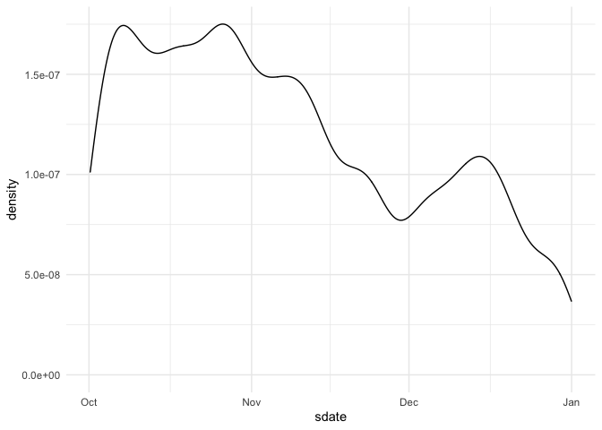<!-- -->
  
  8. A density plot of the events versus time of day.  You can use `mutate()` with `lubridate`'s  `hour()` and `minute()` functions to extract the hour of the day and minute within the hour from `sdate`. Hint: A minute is 1/60 of an hour, so create a variable where 3:30 is 3.5 and 3:45 is 3.75.
  

```r
Trips %>% 
  mutate(hr = hour(sdate), min = minute(sdate), time_of_day = hr + min/60) %>%
  ggplot(aes(x = time_of_day))+
  geom_density()
```

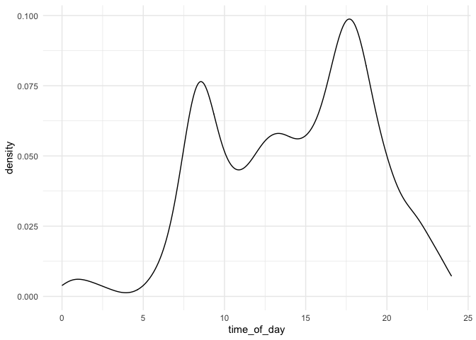<!-- -->
  
  9. A bar graph of the events versus day of the week. Put day on the y-axis.
  

```r
Trips %>%
  mutate(day = weekdays(sdate)) %>% 
  mutate(day = fct_relevel(day, c("Monday", "Tuesday", "Wednesday", "Thursday", "Friday", "Saturday", "Sunday"))) %>% 
  ggplot(aes(y=day))+
  geom_bar(fill = "navyblue")
```

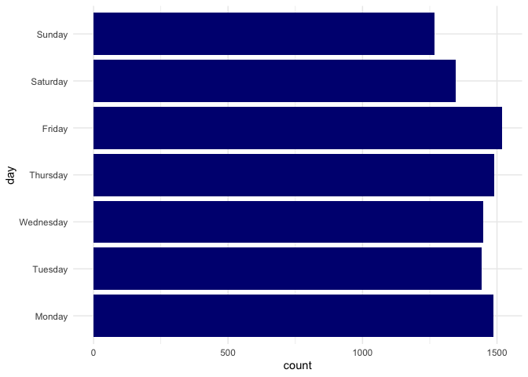<!-- -->
  
  10. Facet your graph from exercise 8. by day of the week. Is there a pattern?
  

```r
Trips %>% 
  mutate(hr = hour(sdate), min = minute(sdate), time_of_day = hr + min/60) %>% 
  mutate(day = weekdays(sdate)) %>% 
  mutate(day = fct_relevel(day, c("Monday", "Tuesday", "Wednesday", "Thursday", "Friday", "Saturday", "Sunday"))) %>%
  ggplot(aes(x = time_of_day))+
  geom_density()+
  facet_wrap(vars(day), scales = "free")
```

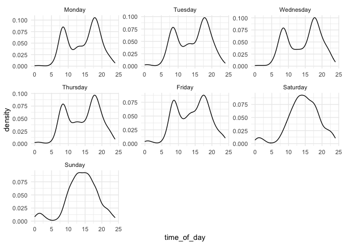<!-- -->
  
  
  **There appears to be a pattern in five out of the seven plots which suggests similarities in data points.**
  
  
The variable `client` describes whether the renter is a regular user (level `Registered`) or has not joined the bike-rental organization (`Causal`). The next set of exercises investigate whether these two different categories of users show different rental behavior and how `client` interacts with the patterns you found in the previous exercises. 

  11. Change the graph from exercise 10 to set the `fill` aesthetic for `geom_density()` to the `client` variable. You should also set `alpha = .5` for transparency and `color=NA` to suppress the outline of the density function.
  

```r
Trips %>% 
  mutate(hr = hour(sdate), min = minute(sdate), time_of_day = hr + min/60) %>% 
  mutate(day = weekdays(sdate)) %>% 
  ggplot(aes(x = time_of_day, fill=client))+
  geom_density(color = NA, alpha = .5)+
  facet_wrap(vars(day), scales = "free")
```

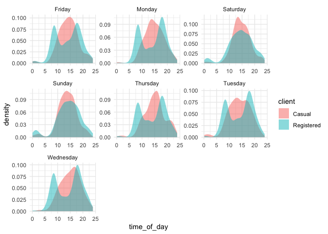<!-- -->

  12. Change the previous graph by adding the argument `position = position_stack()` to `geom_density()`. In your opinion, is this better or worse in terms of telling a story? What are the advantages/disadvantages of each?
  

```r
Trips %>% 
  mutate(hr = hour(sdate), min = minute(sdate), time_of_day = hr + min/60) %>% 
  mutate(day = weekdays(sdate)) %>% 
  ggplot(aes(x = time_of_day, fill=client))+
  geom_density(position=position_stack(), color = NA, alpha = .5)+
  facet_wrap(vars(day), scales = "free")
```

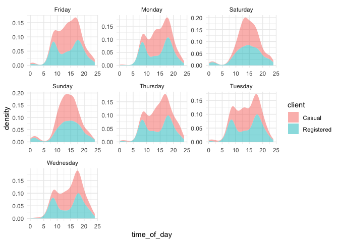<!-- -->
  
  13. In this graph, go back to using the regular density plot (without `position = position_stack()`). Add a new variable to the dataset called `weekend` which will be "weekend" if the day is Saturday or Sunday and  "weekday" otherwise (HINT: use the `ifelse()` function and the `wday()` function from `lubridate`). Then, update the graph from the previous problem by faceting on the new `weekend` variable. 
  

```r
Trips %>% 
  mutate(weekend = ifelse(wday(sdate) %in% c(1,7), "Weekend", "Weekday")) %>% 
  mutate(hr = hour(sdate), min = minute(sdate), time_of_day = hr + min/60) %>% 
  mutate(day = weekdays(sdate)) %>% 
  ggplot(aes(x = time_of_day, fill=client))+
  geom_density(position=position_stack(), color = NA, alpha = .5)+
  facet_wrap(vars(weekend), scales = "free")
```

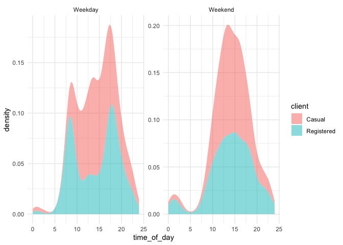<!-- -->
  
  14. Change the graph from the previous problem to facet on `client` and fill with `weekday`. What information does this graph tell you that the previous didn't? Is one graph better than the other?
  

```r
Trips %>% 
  mutate(weekend = ifelse(wday(sdate) %in% c(1,7), "Weekend", "Weekday")) %>% 
  mutate(hr = hour(sdate), min = minute(sdate), time_of_day = hr + min/60) %>% 
  mutate(day = weekdays(sdate)) %>% 
  ggplot(aes(x = time_of_day, fill=weekend))+
  geom_density(position=position_stack(), color = NA, alpha = .5)+
  facet_wrap(vars(client), scales = "free")
```

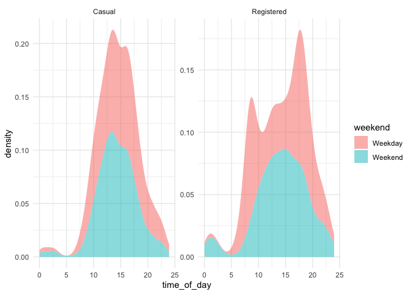<!-- -->
  
### Spatial patterns

  15. Use the latitude and longitude variables in `Stations` to make a visualization of the total number of departures from each station in the `Trips` data. Use either color or size to show the variation in number of departures. We will improve this plot next week when we learn about maps!
  

```r
departure_by_station <- Trips %>% 
  left_join(Stations, by = c("sstation" = "name")) %>% 
  group_by(lat, long) %>% 
  summarize(count = n(),
            prop_casual = mean(client == "Casual"))

departure_by_station %>%
  ggplot(aes(x = long, y = lat, color = count))+
  geom_point()+
  scale_color_viridis_c(option = "magma")
```

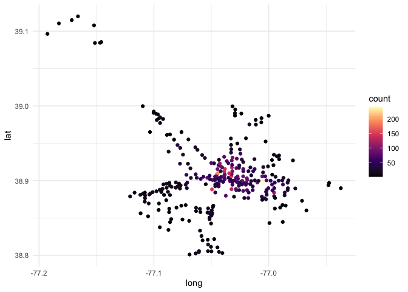<!-- -->
  
  16. Only 14.4% of the trips in our data are carried out by casual users. Create a plot that shows which area(s) have stations with a much higher percentage of departures by casual users. What patterns do you notice? (Again, we'll improve this next week when we learn about maps).
  

```r
departure_by_station %>%
  ggplot(aes(x = long, y = lat, color = prop_casual))+
  geom_point()+
  scale_color_viridis_c(option = "magma")
```

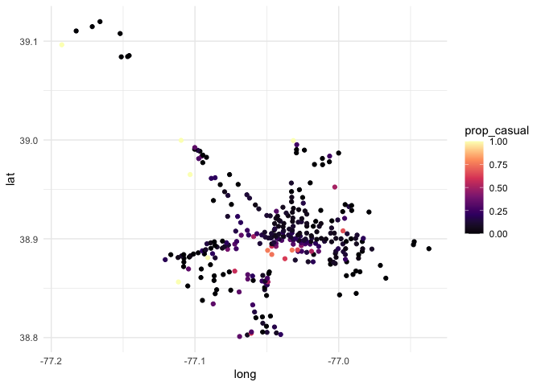<!-- -->
  
### Spatiotemporal patterns

  17. Make a table with the ten station-date combinations (e.g., 14th & V St., 2014-10-14) with the highest number of departures, sorted from most departures to fewest. Save this to a new dataset and print out the dataset. Hint: `as_date(sdate)` converts `sdate` from date-time format to date format. 
  

```r
top_10 <- Trips %>% 
  mutate(date = as_date(sdate)) %>% 
  count(sstation, date) %>% 
  arrange(desc(n)) %>% 
  top_n(10, wt = n)

top_10
```

<div data-pagedtable="false">
  <script data-pagedtable-source type="application/json">
{"columns":[{"label":["sstation"],"name":[1],"type":["chr"],"align":["left"]},{"label":["date"],"name":[2],"type":["date"],"align":["right"]},{"label":["n"],"name":[3],"type":["int"],"align":["right"]}],"data":[{"1":"Columbus Circle / Union Station","2":"2014-11-12","3":"11"},{"1":"Jefferson Dr & 14th St SW","2":"2014-12-27","3":"9"},{"1":"Lincoln Memorial","2":"2014-10-05","3":"9"},{"1":"Lincoln Memorial","2":"2014-10-09","3":"8"},{"1":"17th St & Massachusetts Ave NW","2":"2014-10-06","3":"7"},{"1":"Columbus Circle / Union Station","2":"2014-10-02","3":"7"},{"1":"Georgetown Harbor / 30th St NW","2":"2014-10-25","3":"7"},{"1":"Massachusetts Ave & Dupont Circle NW","2":"2014-10-01","3":"7"},{"1":"New Hampshire Ave & T St NW","2":"2014-10-16","3":"7"},{"1":"14th & V St NW","2":"2014-11-07","3":"6"},{"1":"15th & Euclid St  NW","2":"2014-12-15","3":"6"},{"1":"Columbus Circle / Union Station","2":"2014-10-01","3":"6"},{"1":"Columbus Circle / Union Station","2":"2014-10-08","3":"6"},{"1":"Columbus Circle / Union Station","2":"2014-10-09","3":"6"},{"1":"Columbus Circle / Union Station","2":"2014-10-14","3":"6"},{"1":"Columbus Circle / Union Station","2":"2014-10-17","3":"6"},{"1":"Columbus Circle / Union Station","2":"2014-10-23","3":"6"},{"1":"Columbus Circle / Union Station","2":"2014-10-28","3":"6"},{"1":"Columbus Circle / Union Station","2":"2014-10-31","3":"6"},{"1":"Columbus Circle / Union Station","2":"2014-11-04","3":"6"},{"1":"Columbus Circle / Union Station","2":"2014-12-16","3":"6"},{"1":"Jefferson Dr & 14th St SW","2":"2014-10-18","3":"6"},{"1":"Jefferson Memorial","2":"2014-10-25","3":"6"},{"1":"Lincoln Memorial","2":"2014-10-04","3":"6"},{"1":"Lincoln Memorial","2":"2014-10-18","3":"6"},{"1":"Lincoln Memorial","2":"2014-10-25","3":"6"},{"1":"Massachusetts Ave & Dupont Circle NW","2":"2014-10-23","3":"6"},{"1":"Massachusetts Ave & Dupont Circle NW","2":"2014-11-06","3":"6"},{"1":"North Capitol St & F St NW","2":"2014-10-01","3":"6"},{"1":"Smithsonian / Jefferson Dr & 12th St SW","2":"2014-10-25","3":"6"},{"1":"US Dept of State / Virginia Ave & 21st St NW","2":"2014-12-10","3":"6"}],"options":{"columns":{"min":{},"max":[10]},"rows":{"min":[10],"max":[10]},"pages":{}}}
  </script>
</div>
  
  18. Use a join operation to make a table with only those trips whose departures match those top ten station-date combinations from the previous part.
  

```r
Trips %>% 
  mutate(just_date = as_date(sdate)) %>% 
  inner_join(top_10,
             by = c("sstation", "just_date"="date"))
```

<div data-pagedtable="false">
  <script data-pagedtable-source type="application/json">
{"columns":[{"label":["duration"],"name":[1],"type":["chr"],"align":["left"]},{"label":["sdate"],"name":[2],"type":["dttm"],"align":["right"]},{"label":["sstation"],"name":[3],"type":["chr"],"align":["left"]},{"label":["edate"],"name":[4],"type":["dttm"],"align":["right"]},{"label":["estation"],"name":[5],"type":["chr"],"align":["left"]},{"label":["bikeno"],"name":[6],"type":["chr"],"align":["left"]},{"label":["client"],"name":[7],"type":["chr"],"align":["left"]},{"label":["just_date"],"name":[8],"type":["date"],"align":["right"]},{"label":["n"],"name":[9],"type":["int"],"align":["right"]}],"data":[{"1":"0h 22m 38s","2":"2014-12-15 18:18:00","3":"15th & Euclid St  NW","4":"2014-12-15 18:41:00","5":"8th & H St NW","6":"W00975","7":"Registered","8":"2014-12-15","9":"6"},{"1":"0h 12m 43s","2":"2014-10-02 08:23:00","3":"Columbus Circle / Union Station","4":"2014-10-02 08:36:00","5":"14th St & New York Ave NW","6":"W20228","7":"Registered","8":"2014-10-02","9":"7"},{"1":"0h 2m 58s","2":"2014-11-04 18:47:00","3":"Columbus Circle / Union Station","4":"2014-11-04 18:50:00","5":"8th & F St NE","6":"W20118","7":"Registered","8":"2014-11-04","9":"6"},{"1":"0h 13m 29s","2":"2014-12-10 20:00:00","3":"US Dept of State / Virginia Ave & 21st St NW","4":"2014-12-10 20:13:00","5":"11th & M St NW","6":"W21541","7":"Casual","8":"2014-12-10","9":"6"},{"1":"0h 2m 49s","2":"2014-12-16 18:39:00","3":"Columbus Circle / Union Station","4":"2014-12-16 18:42:00","5":"3rd & H St NE","6":"W21155","7":"Registered","8":"2014-12-16","9":"6"},{"1":"0h 11m 16s","2":"2014-10-17 08:02:00","3":"Columbus Circle / Union Station","4":"2014-10-17 08:13:00","5":"Potomac Ave & 8th St SE","6":"W00991","7":"Registered","8":"2014-10-17","9":"6"},{"1":"0h 26m 24s","2":"2014-10-25 15:22:00","3":"Smithsonian / Jefferson Dr & 12th St SW","4":"2014-10-25 15:48:00","5":"14th & Rhode Island Ave NW","6":"W21892","7":"Casual","8":"2014-10-25","9":"6"},{"1":"0h 7m 57s","2":"2014-10-09 11:34:00","3":"Lincoln Memorial","4":"2014-10-09 11:42:00","5":"21st St & Constitution Ave NW","6":"W20032","7":"Registered","8":"2014-10-09","9":"8"},{"1":"0h 2m 0s","2":"2014-10-23 16:52:00","3":"Columbus Circle / Union Station","4":"2014-10-23 16:54:00","5":"3rd & H St NE","6":"W01428","7":"Registered","8":"2014-10-23","9":"6"},{"1":"2h 10m 20s","2":"2014-10-05 12:35:00","3":"Lincoln Memorial","4":"2014-10-05 14:45:00","5":"Ohio Dr & West Basin Dr SW / MLK & FDR Memorials","6":"W01221","7":"Casual","8":"2014-10-05","9":"9"},{"1":"0h 27m 24s","2":"2014-10-25 13:48:00","3":"Jefferson Memorial","4":"2014-10-25 14:15:00","5":"Smithsonian / Jefferson Dr & 12th St SW","6":"W21241","7":"Casual","8":"2014-10-25","9":"6"},{"1":"0h 3m 35s","2":"2014-12-16 18:40:00","3":"Columbus Circle / Union Station","4":"2014-12-16 18:43:00","5":"8th & F St NE","6":"W00125","7":"Registered","8":"2014-12-16","9":"6"},{"1":"0h 8m 36s","2":"2014-10-23 09:46:00","3":"Massachusetts Ave & Dupont Circle NW","4":"2014-10-23 09:55:00","5":"Wisconsin Ave & O St NW","6":"W01409","7":"Registered","8":"2014-10-23","9":"6"},{"1":"0h 11m 43s","2":"2014-10-28 18:34:00","3":"Columbus Circle / Union Station","4":"2014-10-28 18:45:00","5":"Bladensburg Rd & Benning Rd NE","6":"W00123","7":"Registered","8":"2014-10-28","9":"6"},{"1":"0h 10m 43s","2":"2014-10-17 16:15:00","3":"Columbus Circle / Union Station","4":"2014-10-17 16:26:00","5":"5th & F St NW","6":"W00991","7":"Registered","8":"2014-10-17","9":"6"},{"1":"0h 30m 6s","2":"2014-10-05 11:58:00","3":"Lincoln Memorial","4":"2014-10-05 12:28:00","5":"Jefferson Memorial","6":"W20256","7":"Casual","8":"2014-10-05","9":"9"},{"1":"0h 7m 41s","2":"2014-10-01 22:01:00","3":"Massachusetts Ave & Dupont Circle NW","4":"2014-10-01 22:09:00","5":"14th & Belmont St NW","6":"W20200","7":"Registered","8":"2014-10-01","9":"7"},{"1":"0h 20m 32s","2":"2014-10-16 07:04:00","3":"New Hampshire Ave & T St NW","4":"2014-10-16 07:25:00","5":"North Capitol St & G Pl NE","6":"W21470","7":"Registered","8":"2014-10-16","9":"7"},{"1":"0h 13m 0s","2":"2014-11-12 06:08:00","3":"Columbus Circle / Union Station","4":"2014-11-12 06:21:00","5":"Maryland & Independence Ave SW","6":"W00733","7":"Registered","8":"2014-11-12","9":"11"},{"1":"1h 14m 57s","2":"2014-10-04 19:26:00","3":"Lincoln Memorial","4":"2014-10-04 20:41:00","5":"Smithsonian / Jefferson Dr & 12th St SW","6":"W20167","7":"Casual","8":"2014-10-04","9":"6"},{"1":"0h 38m 30s","2":"2014-10-25 16:26:00","3":"Lincoln Memorial","4":"2014-10-25 17:04:00","5":"Smithsonian / Jefferson Dr & 12th St SW","6":"W20184","7":"Casual","8":"2014-10-25","9":"6"},{"1":"0h 9m 26s","2":"2014-10-08 07:51:00","3":"Columbus Circle / Union Station","4":"2014-10-08 08:00:00","5":"Washington & Independence Ave SW/HHS","6":"W20281","7":"Registered","8":"2014-10-08","9":"6"},{"1":"0h 23m 24s","2":"2014-10-02 09:19:00","3":"Columbus Circle / Union Station","4":"2014-10-02 09:42:00","5":"17th & K St NW / Farragut Square","6":"W00281","7":"Registered","8":"2014-10-02","9":"7"},{"1":"0h 4m 50s","2":"2014-10-23 19:46:00","3":"Massachusetts Ave & Dupont Circle NW","4":"2014-10-23 19:51:00","5":"California St & Florida Ave NW","6":"W01279","7":"Registered","8":"2014-10-23","9":"6"},{"1":"0h 27m 24s","2":"2014-12-10 16:40:00","3":"US Dept of State / Virginia Ave & 21st St NW","4":"2014-12-10 17:07:00","5":"Georgia & New Hampshire Ave NW","6":"W01144","7":"Registered","8":"2014-12-10","9":"6"},{"1":"0h 13m 36s","2":"2014-12-27 13:43:00","3":"Jefferson Dr & 14th St SW","4":"2014-12-27 13:56:00","5":"Jefferson Memorial","6":"W00924","7":"Casual","8":"2014-12-27","9":"9"},{"1":"0h 3m 47s","2":"2014-12-10 15:11:00","3":"US Dept of State / Virginia Ave & 21st St NW","4":"2014-12-10 15:15:00","5":"22nd & I St NW / Foggy Bottom","6":"W01351","7":"Registered","8":"2014-12-10","9":"6"},{"1":"0h 12m 38s","2":"2014-10-25 13:48:00","3":"Jefferson Memorial","4":"2014-10-25 14:01:00","5":"Independence Ave & L'Enfant Plaza SW/DOE","6":"W20452","7":"Casual","8":"2014-10-25","9":"6"},{"1":"0h 3m 41s","2":"2014-10-06 12:45:00","3":"17th St & Massachusetts Ave NW","4":"2014-10-06 12:49:00","5":"Massachusetts Ave & Dupont Circle NW","6":"W01470","7":"Registered","8":"2014-10-06","9":"7"},{"1":"0h 15m 0s","2":"2014-12-15 09:54:00","3":"15th & Euclid St  NW","4":"2014-12-15 10:09:00","5":"C & O Canal & Wisconsin Ave NW","6":"W21340","7":"Registered","8":"2014-12-15","9":"6"},{"1":"0h 18m 2s","2":"2014-10-25 17:59:00","3":"Lincoln Memorial","4":"2014-10-25 18:17:00","5":"Jefferson Memorial","6":"W21095","7":"Casual","8":"2014-10-25","9":"6"},{"1":"0h 11m 15s","2":"2014-10-16 09:05:00","3":"New Hampshire Ave & T St NW","4":"2014-10-16 09:16:00","5":"17th & G St NW","6":"W20852","7":"Registered","8":"2014-10-16","9":"7"},{"1":"0h 36m 16s","2":"2014-10-18 11:32:00","3":"Lincoln Memorial","4":"2014-10-18 12:08:00","5":"3rd & D St SE","6":"W00993","7":"Casual","8":"2014-10-18","9":"6"},{"1":"0h 13m 38s","2":"2014-10-09 22:07:00","3":"Lincoln Memorial","4":"2014-10-09 22:21:00","5":"Jefferson Memorial","6":"W20283","7":"Casual","8":"2014-10-09","9":"8"},{"1":"0h 24m 26s","2":"2014-10-25 18:01:00","3":"Georgetown Harbor / 30th St NW","4":"2014-10-25 18:26:00","5":"Georgetown Harbor / 30th St NW","6":"W21957","7":"Casual","8":"2014-10-25","9":"7"},{"1":"0h 28m 40s","2":"2014-10-18 15:42:00","3":"Lincoln Memorial","4":"2014-10-18 16:11:00","5":"Lincoln Memorial","6":"W21289","7":"Casual","8":"2014-10-18","9":"6"},{"1":"0h 6m 58s","2":"2014-10-14 17:55:00","3":"Columbus Circle / Union Station","4":"2014-10-14 18:02:00","5":"13th & D St NE","6":"W00655","7":"Registered","8":"2014-10-14","9":"6"},{"1":"0h 17m 49s","2":"2014-10-25 16:18:00","3":"Georgetown Harbor / 30th St NW","4":"2014-10-25 16:36:00","5":"Harvard St & Adams Mill Rd NW","6":"W00842","7":"Registered","8":"2014-10-25","9":"7"},{"1":"0h 9m 9s","2":"2014-10-23 17:14:00","3":"Columbus Circle / Union Station","4":"2014-10-23 17:23:00","5":"Lincoln Park / 13th & East Capitol St NE","6":"W20022","7":"Registered","8":"2014-10-23","9":"6"},{"1":"0h 14m 39s","2":"2014-10-17 18:16:00","3":"Columbus Circle / Union Station","4":"2014-10-17 18:30:00","5":"Bladensburg Rd & Benning Rd NE","6":"W01175","7":"Registered","8":"2014-10-17","9":"6"},{"1":"0h 13m 34s","2":"2014-10-04 18:12:00","3":"Lincoln Memorial","4":"2014-10-04 18:26:00","5":"Jefferson Memorial","6":"W20167","7":"Casual","8":"2014-10-04","9":"6"},{"1":"0h 8m 8s","2":"2014-10-02 06:07:00","3":"Columbus Circle / Union Station","4":"2014-10-02 06:16:00","5":"8th & D St NW","6":"W21071","7":"Registered","8":"2014-10-02","9":"7"},{"1":"0h 12m 36s","2":"2014-10-09 13:50:00","3":"Columbus Circle / Union Station","4":"2014-10-09 14:03:00","5":"Neal St & Trinidad Ave NE","6":"W01311","7":"Registered","8":"2014-10-09","9":"6"},{"1":"0h 3m 4s","2":"2014-10-31 15:48:00","3":"Columbus Circle / Union Station","4":"2014-10-31 15:51:00","5":"8th & F St NE","6":"W01030","7":"Registered","8":"2014-10-31","9":"6"},{"1":"0h 3m 27s","2":"2014-10-01 18:07:00","3":"Columbus Circle / Union Station","4":"2014-10-01 18:10:00","5":"3rd & H St NE","6":"W00393","7":"Registered","8":"2014-10-01","9":"6"},{"1":"0h 6m 31s","2":"2014-10-01 08:49:00","3":"Massachusetts Ave & Dupont Circle NW","4":"2014-10-01 08:56:00","5":"New Hampshire Ave & 24th St NW","6":"W21010","7":"Registered","8":"2014-10-01","9":"7"},{"1":"0h 17m 0s","2":"2014-10-25 16:19:00","3":"Georgetown Harbor / 30th St NW","4":"2014-10-25 16:36:00","5":"Harvard St & Adams Mill Rd NW","6":"W20600","7":"Casual","8":"2014-10-25","9":"7"},{"1":"0h 17m 45s","2":"2014-10-09 13:43:00","3":"Lincoln Memorial","4":"2014-10-09 14:01:00","5":"Smithsonian / Jefferson Dr & 12th St SW","6":"W01464","7":"Casual","8":"2014-10-09","9":"8"},{"1":"0h 7m 23s","2":"2014-10-14 07:43:00","3":"Columbus Circle / Union Station","4":"2014-10-14 07:51:00","5":"Maryland & Independence Ave SW","6":"W20498","7":"Registered","8":"2014-10-14","9":"6"},{"1":"0h 9m 8s","2":"2014-10-01 09:06:00","3":"Columbus Circle / Union Station","4":"2014-10-01 09:15:00","5":"Metro Center / 12th & G St NW","6":"W20031","7":"Casual","8":"2014-10-01","9":"6"},{"1":"0h 35m 0s","2":"2014-10-25 16:28:00","3":"Lincoln Memorial","4":"2014-10-25 17:03:00","5":"Smithsonian / Jefferson Dr & 12th St SW","6":"W21054","7":"Casual","8":"2014-10-25","9":"6"},{"1":"0h 9m 47s","2":"2014-12-15 07:25:00","3":"15th & Euclid St  NW","4":"2014-12-15 07:34:00","5":"3rd & Elm St NW","6":"W20420","7":"Registered","8":"2014-12-15","9":"6"},{"1":"0h 11m 2s","2":"2014-10-04 22:47:00","3":"Lincoln Memorial","4":"2014-10-04 22:58:00","5":"Jefferson Memorial","6":"W01323","7":"Casual","8":"2014-10-04","9":"6"},{"1":"0h 6m 47s","2":"2014-10-08 18:08:00","3":"Columbus Circle / Union Station","4":"2014-10-08 18:15:00","5":"15th & F St NE","6":"W20671","7":"Registered","8":"2014-10-08","9":"6"},{"1":"0h 24m 44s","2":"2014-10-18 17:45:00","3":"Jefferson Dr & 14th St SW","4":"2014-10-18 18:09:00","5":"Lincoln Memorial","6":"W00970","7":"Casual","8":"2014-10-18","9":"6"},{"1":"0h 3m 49s","2":"2014-10-31 16:56:00","3":"Columbus Circle / Union Station","4":"2014-10-31 17:00:00","5":"8th & F St NE","6":"W00335","7":"Registered","8":"2014-10-31","9":"6"},{"1":"0h 31m 38s","2":"2014-10-18 18:41:00","3":"Jefferson Dr & 14th St SW","4":"2014-10-18 19:13:00","5":"Jefferson Dr & 14th St SW","6":"W21682","7":"Casual","8":"2014-10-18","9":"6"},{"1":"0h 11m 5s","2":"2014-10-06 21:33:00","3":"17th St & Massachusetts Ave NW","4":"2014-10-06 21:44:00","5":"10th & U St NW","6":"W20675","7":"Registered","8":"2014-10-06","9":"7"},{"1":"0h 57m 4s","2":"2014-12-27 09:47:00","3":"Jefferson Dr & 14th St SW","4":"2014-12-27 10:44:00","5":"Smithsonian / Jefferson Dr & 12th St SW","6":"W01059","7":"Casual","8":"2014-12-27","9":"9"},{"1":"0h 9m 23s","2":"2014-11-07 19:54:00","3":"14th & V St NW","4":"2014-11-07 20:03:00","5":"18th & M St NW","6":"W21318","7":"Registered","8":"2014-11-07","9":"6"},{"1":"0h 20m 5s","2":"2014-10-05 18:30:00","3":"Lincoln Memorial","4":"2014-10-05 18:50:00","5":"14th St & New York Ave NW","6":"W20890","7":"Casual","8":"2014-10-05","9":"9"},{"1":"0h 53m 48s","2":"2014-12-27 09:50:00","3":"Jefferson Dr & 14th St SW","4":"2014-12-27 10:44:00","5":"Smithsonian / Jefferson Dr & 12th St SW","6":"W00653","7":"Casual","8":"2014-12-27","9":"9"},{"1":"0h 19m 21s","2":"2014-12-27 11:16:00","3":"Jefferson Dr & 14th St SW","4":"2014-12-27 11:35:00","5":"Maryland & Independence Ave SW","6":"W20232","7":"Casual","8":"2014-12-27","9":"9"},{"1":"0h 12m 26s","2":"2014-10-06 19:13:00","3":"17th St & Massachusetts Ave NW","4":"2014-10-06 19:25:00","5":"New Jersey Ave & N St NW/Dunbar HS","6":"W20069","7":"Registered","8":"2014-10-06","9":"7"},{"1":"1h 43m 11s","2":"2014-10-25 19:02:00","3":"Smithsonian / Jefferson Dr & 12th St SW","4":"2014-10-25 20:45:00","5":"Smithsonian / Jefferson Dr & 12th St SW","6":"W21296","7":"Casual","8":"2014-10-25","9":"6"},{"1":"0h 28m 33s","2":"2014-10-25 17:16:00","3":"Georgetown Harbor / 30th St NW","4":"2014-10-25 17:44:00","5":"Lincoln Memorial","6":"W21439","7":"Casual","8":"2014-10-25","9":"7"},{"1":"0h 8m 48s","2":"2014-10-31 17:11:00","3":"Columbus Circle / Union Station","4":"2014-10-31 17:20:00","5":"13th & H St NE","6":"W21602","7":"Registered","8":"2014-10-31","9":"6"},{"1":"0h 20m 47s","2":"2014-10-01 22:46:00","3":"Massachusetts Ave & Dupont Circle NW","4":"2014-10-01 23:07:00","5":"North Capitol St & F St NW","6":"W21122","7":"Registered","8":"2014-10-01","9":"7"},{"1":"0h 14m 5s","2":"2014-12-27 15:52:00","3":"Jefferson Dr & 14th St SW","4":"2014-12-27 16:06:00","5":"Maryland & Independence Ave SW","6":"W00022","7":"Casual","8":"2014-12-27","9":"9"},{"1":"0h 32m 46s","2":"2014-10-17 15:59:00","3":"Columbus Circle / Union Station","4":"2014-10-17 16:32:00","5":"Lincoln Memorial","6":"W00923","7":"Casual","8":"2014-10-17","9":"6"},{"1":"0h 6m 33s","2":"2014-10-01 18:08:00","3":"North Capitol St & F St NW","4":"2014-10-01 18:14:00","5":"M St & Delaware Ave NE","6":"W20595","7":"Registered","8":"2014-10-01","9":"6"},{"1":"0h 29m 4s","2":"2014-10-25 11:06:00","3":"Jefferson Memorial","4":"2014-10-25 11:35:00","5":"1st & M St NE","6":"W20830","7":"Casual","8":"2014-10-25","9":"6"},{"1":"0h 8m 52s","2":"2014-11-07 17:41:00","3":"14th & V St NW","4":"2014-11-07 17:50:00","5":"17th St & Massachusetts Ave NW","6":"W00595","7":"Registered","8":"2014-11-07","9":"6"},{"1":"0h 9m 13s","2":"2014-10-01 20:48:00","3":"Columbus Circle / Union Station","4":"2014-10-01 20:57:00","5":"3rd & D St SE","6":"W21573","7":"Registered","8":"2014-10-01","9":"6"},{"1":"0h 4m 39s","2":"2014-11-06 08:50:00","3":"Massachusetts Ave & Dupont Circle NW","4":"2014-11-06 08:54:00","5":"19th & K St NW","6":"W01029","7":"Registered","8":"2014-11-06","9":"6"},{"1":"0h 11m 48s","2":"2014-11-12 07:42:00","3":"Columbus Circle / Union Station","4":"2014-11-12 07:54:00","5":"L'Enfant Plaza / 7th & C St SW","6":"W20307","7":"Registered","8":"2014-11-12","9":"11"},{"1":"0h 32m 15s","2":"2014-10-18 11:57:00","3":"Jefferson Dr & 14th St SW","4":"2014-10-18 12:30:00","5":"Constitution Ave & 2nd St NW/DOL","6":"W00877","7":"Casual","8":"2014-10-18","9":"6"},{"1":"0h 36m 38s","2":"2014-10-05 11:11:00","3":"Lincoln Memorial","4":"2014-10-05 11:48:00","5":"Maryland & Independence Ave SW","6":"W21644","7":"Casual","8":"2014-10-05","9":"9"},{"1":"0h 16m 10s","2":"2014-10-06 08:47:00","3":"17th St & Massachusetts Ave NW","4":"2014-10-06 09:03:00","5":"25th St & Pennsylvania Ave NW","6":"W20141","7":"Registered","8":"2014-10-06","9":"7"},{"1":"0h 8m 19s","2":"2014-11-06 20:55:00","3":"Massachusetts Ave & Dupont Circle NW","4":"2014-11-06 21:04:00","5":"14th & V St NW","6":"W00607","7":"Registered","8":"2014-11-06","9":"6"},{"1":"0h 19m 3s","2":"2014-10-25 16:10:00","3":"Smithsonian / Jefferson Dr & 12th St SW","4":"2014-10-25 16:29:00","5":"North Capitol St & F St NW","6":"W21031","7":"Casual","8":"2014-10-25","9":"6"},{"1":"0h 12m 58s","2":"2014-10-31 08:29:00","3":"Columbus Circle / Union Station","4":"2014-10-31 08:42:00","5":"14th & D St NW / Ronald Reagan Building","6":"W20552","7":"Registered","8":"2014-10-31","9":"6"},{"1":"0h 38m 22s","2":"2014-12-27 15:50:00","3":"Jefferson Dr & 14th St SW","4":"2014-12-27 16:28:00","5":"Jefferson Memorial","6":"W21946","7":"Casual","8":"2014-12-27","9":"9"},{"1":"0h 8m 44s","2":"2014-10-16 08:19:00","3":"New Hampshire Ave & T St NW","4":"2014-10-16 08:28:00","5":"19th & K St NW","6":"W20787","7":"Registered","8":"2014-10-16","9":"7"},{"1":"0h 5m 35s","2":"2014-11-04 17:56:00","3":"Columbus Circle / Union Station","4":"2014-11-04 18:02:00","5":"11th & H St NE","6":"W20512","7":"Registered","8":"2014-11-04","9":"6"},{"1":"0h 11m 19s","2":"2014-10-25 16:08:00","3":"Lincoln Memorial","4":"2014-10-25 16:20:00","5":"Jefferson Memorial","6":"W01426","7":"Casual","8":"2014-10-25","9":"6"},{"1":"0h 25m 15s","2":"2014-10-25 13:42:00","3":"Georgetown Harbor / 30th St NW","4":"2014-10-25 14:08:00","5":"Constitution Ave & 2nd St NW/DOL","6":"W21629","7":"Casual","8":"2014-10-25","9":"7"},{"1":"0h 11m 54s","2":"2014-10-09 13:47:00","3":"Lincoln Memorial","4":"2014-10-09 13:59:00","5":"Smithsonian / Jefferson Dr & 12th St SW","6":"W01384","7":"Casual","8":"2014-10-09","9":"8"},{"1":"0h 7m 27s","2":"2014-10-17 17:00:00","3":"Columbus Circle / Union Station","4":"2014-10-17 17:07:00","5":"Eastern Market Metro / Pennsylvania Ave & 7th St SE","6":"W00695","7":"Registered","8":"2014-10-17","9":"6"},{"1":"0h 9m 51s","2":"2014-10-31 08:47:00","3":"Columbus Circle / Union Station","4":"2014-10-31 08:57:00","5":"Independence Ave & L'Enfant Plaza SW/DOE","6":"W20472","7":"Registered","8":"2014-10-31","9":"6"},{"1":"0h 9m 45s","2":"2014-11-12 08:18:00","3":"Columbus Circle / Union Station","4":"2014-11-12 08:28:00","5":"Potomac Ave & 8th St SE","6":"W01369","7":"Registered","8":"2014-11-12","9":"11"},{"1":"0h 36m 0s","2":"2014-11-06 07:30:00","3":"Massachusetts Ave & Dupont Circle NW","4":"2014-11-06 08:06:00","5":"Fort Totten Metro","6":"W20452","7":"Registered","8":"2014-11-06","9":"6"},{"1":"0h 15m 57s","2":"2014-10-14 18:50:00","3":"Columbus Circle / Union Station","4":"2014-10-14 19:06:00","5":"Maryland & Independence Ave SW","6":"W00951","7":"Registered","8":"2014-10-14","9":"6"},{"1":"0h 8m 51s","2":"2014-10-01 18:09:00","3":"North Capitol St & F St NW","4":"2014-10-01 18:18:00","5":"Eastern Market / 7th & North Carolina Ave SE","6":"W00418","7":"Registered","8":"2014-10-01","9":"6"},{"1":"0h 26m 32s","2":"2014-11-04 08:52:00","3":"Columbus Circle / Union Station","4":"2014-11-04 09:18:00","5":"Washington & Independence Ave SW/HHS","6":"W21429","7":"Registered","8":"2014-11-04","9":"6"},{"1":"0h 9m 38s","2":"2014-12-15 10:10:00","3":"15th & Euclid St  NW","4":"2014-12-15 10:19:00","5":"Massachusetts Ave & Dupont Circle NW","6":"W01267","7":"Registered","8":"2014-12-15","9":"6"},{"1":"0h 10m 52s","2":"2014-11-07 07:38:00","3":"14th & V St NW","4":"2014-11-07 07:49:00","5":"New York Ave & 15th St NW","6":"W01452","7":"Registered","8":"2014-11-07","9":"6"},{"1":"0h 17m 23s","2":"2014-10-01 18:34:00","3":"North Capitol St & F St NW","4":"2014-10-01 18:51:00","5":"10th & U St NW","6":"W20867","7":"Registered","8":"2014-10-01","9":"6"},{"1":"0h 8m 11s","2":"2014-10-09 08:54:00","3":"Columbus Circle / Union Station","4":"2014-10-09 09:02:00","5":"7th & F St NW / National Portrait Gallery","6":"W00292","7":"Registered","8":"2014-10-09","9":"6"},{"1":"0h 9m 21s","2":"2014-12-27 16:04:00","3":"Jefferson Dr & 14th St SW","4":"2014-12-27 16:13:00","5":"Washington & Independence Ave SW/HHS","6":"W20584","7":"Registered","8":"2014-12-27","9":"9"},{"1":"0h 9m 10s","2":"2014-10-16 11:46:00","3":"New Hampshire Ave & T St NW","4":"2014-10-16 11:55:00","5":"19th St & Pennsylvania Ave NW","6":"W01078","7":"Registered","8":"2014-10-16","9":"7"},{"1":"0h 6m 41s","2":"2014-10-06 07:59:00","3":"17th St & Massachusetts Ave NW","4":"2014-10-06 08:06:00","5":"14th & R St NW","6":"W00684","7":"Registered","8":"2014-10-06","9":"7"},{"1":"0h 7m 46s","2":"2014-10-09 17:50:00","3":"Columbus Circle / Union Station","4":"2014-10-09 17:57:00","5":"Eastern Market Metro / Pennsylvania Ave & 7th St SE","6":"W21025","7":"Registered","8":"2014-10-09","9":"6"},{"1":"0h 8m 53s","2":"2014-12-16 08:15:00","3":"Columbus Circle / Union Station","4":"2014-12-16 08:23:00","5":"Washington & Independence Ave SW/HHS","6":"W21173","7":"Registered","8":"2014-12-16","9":"6"},{"1":"0h 13m 37s","2":"2014-10-23 19:39:00","3":"Massachusetts Ave & Dupont Circle NW","4":"2014-10-23 19:53:00","5":"12th & L St NW","6":"W20311","7":"Registered","8":"2014-10-23","9":"6"},{"1":"0h 7m 41s","2":"2014-11-07 16:41:00","3":"14th & V St NW","4":"2014-11-07 16:49:00","5":"Massachusetts Ave & Dupont Circle NW","6":"W20094","7":"Registered","8":"2014-11-07","9":"6"},{"1":"0h 4m 19s","2":"2014-10-09 19:04:00","3":"Columbus Circle / Union Station","4":"2014-10-09 19:08:00","5":"8th & F St NE","6":"W01147","7":"Registered","8":"2014-10-09","9":"6"},{"1":"0h 10m 17s","2":"2014-11-12 10:02:00","3":"Columbus Circle / Union Station","4":"2014-11-12 10:12:00","5":"11th & F St NW","6":"W00766","7":"Casual","8":"2014-11-12","9":"11"},{"1":"0h 38m 30s","2":"2014-10-28 12:04:00","3":"Columbus Circle / Union Station","4":"2014-10-28 12:42:00","5":"Lincoln Memorial","6":"W20627","7":"Casual","8":"2014-10-28","9":"6"},{"1":"0h 21m 46s","2":"2014-10-01 20:56:00","3":"North Capitol St & F St NW","4":"2014-10-01 21:18:00","5":"Kennedy Center","6":"W01187","7":"Registered","8":"2014-10-01","9":"6"},{"1":"0h 9m 45s","2":"2014-11-12 20:07:00","3":"Columbus Circle / Union Station","4":"2014-11-12 20:17:00","5":"13th & H St NE","6":"W20481","7":"Registered","8":"2014-11-12","9":"11"},{"1":"0h 42m 27s","2":"2014-10-04 14:04:00","3":"Lincoln Memorial","4":"2014-10-04 14:46:00","5":"Columbus Circle / Union Station","6":"W01378","7":"Registered","8":"2014-10-04","9":"6"},{"1":"0h 14m 48s","2":"2014-11-07 08:00:00","3":"14th & V St NW","4":"2014-11-07 08:14:00","5":"17th & G St NW","6":"W01215","7":"Registered","8":"2014-11-07","9":"6"},{"1":"0h 3m 9s","2":"2014-10-06 19:22:00","3":"17th St & Massachusetts Ave NW","4":"2014-10-06 19:26:00","5":"15th & P St NW","6":"W00409","7":"Registered","8":"2014-10-06","9":"7"},{"1":"0h 4m 48s","2":"2014-12-15 05:30:00","3":"15th & Euclid St  NW","4":"2014-12-15 05:35:00","5":"14th & R St NW","6":"W01145","7":"Registered","8":"2014-12-15","9":"6"},{"1":"0h 3m 34s","2":"2014-10-08 17:35:00","3":"Columbus Circle / Union Station","4":"2014-10-08 17:38:00","5":"8th & F St NE","6":"W20556","7":"Registered","8":"2014-10-08","9":"6"},{"1":"0h 33m 30s","2":"2014-10-25 17:33:00","3":"Smithsonian / Jefferson Dr & 12th St SW","4":"2014-10-25 18:06:00","5":"22nd & I St NW / Foggy Bottom","6":"W20759","7":"Registered","8":"2014-10-25","9":"6"},{"1":"0h 10m 33s","2":"2014-11-07 14:22:00","3":"14th & V St NW","4":"2014-11-07 14:32:00","5":"8th & H St NW","6":"W21189","7":"Registered","8":"2014-11-07","9":"6"},{"1":"0h 7m 51s","2":"2014-10-01 18:21:00","3":"Massachusetts Ave & Dupont Circle NW","4":"2014-10-01 18:29:00","5":"Calvert St & Woodley Pl NW","6":"W21466","7":"Registered","8":"2014-10-01","9":"7"},{"1":"0h 3m 52s","2":"2014-10-28 17:25:00","3":"Columbus Circle / Union Station","4":"2014-10-28 17:29:00","5":"8th & F St NE","6":"W20990","7":"Registered","8":"2014-10-28","9":"6"},{"1":"0h 4m 18s","2":"2014-11-04 18:08:00","3":"Columbus Circle / Union Station","4":"2014-11-04 18:13:00","5":"6th & H St NE","6":"W20171","7":"Registered","8":"2014-11-04","9":"6"},{"1":"0h 3m 33s","2":"2014-10-02 09:18:00","3":"Columbus Circle / Union Station","4":"2014-10-02 09:22:00","5":"Constitution Ave & 2nd St NW/DOL","6":"W00490","7":"Registered","8":"2014-10-02","9":"7"},{"1":"0h 6m 19s","2":"2014-10-14 18:20:00","3":"Columbus Circle / Union Station","4":"2014-10-14 18:26:00","5":"13th & D St NE","6":"W20375","7":"Registered","8":"2014-10-14","9":"6"},{"1":"1h 15m 39s","2":"2014-10-25 13:43:00","3":"Smithsonian / Jefferson Dr & 12th St SW","4":"2014-10-25 14:59:00","5":"Ohio Dr & West Basin Dr SW / MLK & FDR Memorials","6":"W01304","7":"Casual","8":"2014-10-25","9":"6"},{"1":"0h 15m 47s","2":"2014-10-08 13:56:00","3":"Columbus Circle / Union Station","4":"2014-10-08 14:12:00","5":"Thomas Circle","6":"W21389","7":"Registered","8":"2014-10-08","9":"6"},{"1":"0h 11m 47s","2":"2014-10-14 19:27:00","3":"Columbus Circle / Union Station","4":"2014-10-14 19:39:00","5":"15th & East Capitol St NE","6":"W20622","7":"Casual","8":"2014-10-14","9":"6"},{"1":"0h 0m 15s","2":"2014-10-28 08:21:00","3":"Columbus Circle / Union Station","4":"2014-10-28 08:21:00","5":"Columbus Circle / Union Station","6":"W01315","7":"Registered","8":"2014-10-28","9":"6"},{"1":"0h 14m 35s","2":"2014-10-05 19:49:00","3":"Lincoln Memorial","4":"2014-10-05 20:04:00","5":"Smithsonian / Jefferson Dr & 12th St SW","6":"W20974","7":"Casual","8":"2014-10-05","9":"9"},{"1":"0h 18m 32s","2":"2014-10-25 13:45:00","3":"Lincoln Memorial","4":"2014-10-25 14:03:00","5":"Jefferson Dr & 14th St SW","6":"W21212","7":"Casual","8":"2014-10-25","9":"6"},{"1":"1h 17m 37s","2":"2014-10-18 12:35:00","3":"Jefferson Dr & 14th St SW","4":"2014-10-18 13:52:00","5":"Independence Ave & L'Enfant Plaza SW/DOE","6":"W01442","7":"Casual","8":"2014-10-18","9":"6"},{"1":"0h 12m 22s","2":"2014-10-08 07:39:00","3":"Columbus Circle / Union Station","4":"2014-10-08 07:52:00","5":"4th & E St SW","6":"W00917","7":"Registered","8":"2014-10-08","9":"6"},{"1":"0h 18m 14s","2":"2014-10-02 14:09:00","3":"Columbus Circle / Union Station","4":"2014-10-02 14:27:00","5":"New York Ave & 15th St NW","6":"W00759","7":"Casual","8":"2014-10-02","9":"7"},{"1":"1h 32m 53s","2":"2014-10-09 16:51:00","3":"Lincoln Memorial","4":"2014-10-09 18:24:00","5":"14th & D St NW / Ronald Reagan Building","6":"W20284","7":"Casual","8":"2014-10-09","9":"8"},{"1":"0h 10m 15s","2":"2014-10-17 14:11:00","3":"Columbus Circle / Union Station","4":"2014-10-17 14:21:00","5":"Lincoln Park / 13th & East Capitol St NE","6":"W20148","7":"Registered","8":"2014-10-17","9":"6"},{"1":"0h 9m 14s","2":"2014-10-01 15:27:00","3":"North Capitol St & F St NW","4":"2014-10-01 15:36:00","5":"Maryland & Independence Ave SW","6":"W01054","7":"Registered","8":"2014-10-01","9":"6"},{"1":"0h 1m 48s","2":"2014-10-01 19:28:00","3":"Massachusetts Ave & Dupont Circle NW","4":"2014-10-01 19:29:00","5":"21st & M St NW","6":"W00928","7":"Registered","8":"2014-10-01","9":"7"},{"1":"0h 5m 33s","2":"2014-10-25 11:11:00","3":"Georgetown Harbor / 30th St NW","4":"2014-10-25 11:17:00","5":"34th & Water St NW","6":"W20311","7":"Casual","8":"2014-10-25","9":"7"},{"1":"0h 5m 35s","2":"2014-10-01 17:49:00","3":"Columbus Circle / Union Station","4":"2014-10-01 17:55:00","5":"11th & H St NE","6":"W20904","7":"Registered","8":"2014-10-01","9":"6"},{"1":"0h 3m 57s","2":"2014-10-06 18:30:00","3":"17th St & Massachusetts Ave NW","4":"2014-10-06 18:34:00","5":"15th & P St NW","6":"W21041","7":"Registered","8":"2014-10-06","9":"7"},{"1":"0h 25m 37s","2":"2014-10-05 11:53:00","3":"Lincoln Memorial","4":"2014-10-05 12:19:00","5":"Iwo Jima Memorial/N Meade & 14th St N","6":"W21089","7":"Casual","8":"2014-10-05","9":"9"},{"1":"0h 6m 23s","2":"2014-10-23 01:35:00","3":"Columbus Circle / Union Station","4":"2014-10-23 01:41:00","5":"13th & D St NE","6":"W00972","7":"Registered","8":"2014-10-23","9":"6"},{"1":"0h 8m 45s","2":"2014-10-09 08:33:00","3":"Columbus Circle / Union Station","4":"2014-10-09 08:42:00","5":"1st & K St SE","6":"W20099","7":"Registered","8":"2014-10-09","9":"6"},{"1":"0h 6m 28s","2":"2014-11-12 15:02:00","3":"Columbus Circle / Union Station","4":"2014-11-12 15:08:00","5":"11th & H St NE","6":"W01357","7":"Registered","8":"2014-11-12","9":"11"},{"1":"0h 27m 4s","2":"2014-10-09 07:48:00","3":"Lincoln Memorial","4":"2014-10-09 08:15:00","5":"8th & Eye St SE / Barracks Row","6":"W21619","7":"Registered","8":"2014-10-09","9":"8"},{"1":"1h 22m 31s","2":"2014-12-27 12:57:00","3":"Jefferson Dr & 14th St SW","4":"2014-12-27 14:20:00","5":"New York Ave & 15th St NW","6":"W21494","7":"Casual","8":"2014-12-27","9":"9"},{"1":"0h 13m 46s","2":"2014-10-31 11:34:00","3":"Columbus Circle / Union Station","4":"2014-10-31 11:48:00","5":"3rd & Tingey St SE","6":"W20931","7":"Registered","8":"2014-10-31","9":"6"},{"1":"0h 21m 16s","2":"2014-10-05 12:01:00","3":"Lincoln Memorial","4":"2014-10-05 12:23:00","5":"Lincoln Memorial","6":"W01177","7":"Casual","8":"2014-10-05","9":"9"},{"1":"0h 3m 45s","2":"2014-11-06 09:00:00","3":"Massachusetts Ave & Dupont Circle NW","4":"2014-11-06 09:04:00","5":"24th & N St NW","6":"W20333","7":"Registered","8":"2014-11-06","9":"6"},{"1":"0h 55m 14s","2":"2014-10-25 13:05:00","3":"Smithsonian / Jefferson Dr & 12th St SW","4":"2014-10-25 14:00:00","5":"Smithsonian / Jefferson Dr & 12th St SW","6":"W21630","7":"Casual","8":"2014-10-25","9":"6"},{"1":"0h 41m 18s","2":"2014-10-05 20:53:00","3":"Lincoln Memorial","4":"2014-10-05 21:35:00","5":"New York Ave & 15th St NW","6":"W20605","7":"Registered","8":"2014-10-05","9":"9"},{"1":"0h 4m 22s","2":"2014-10-14 18:35:00","3":"Columbus Circle / Union Station","4":"2014-10-14 18:39:00","5":"4th & East Capitol St NE","6":"W01230","7":"Registered","8":"2014-10-14","9":"6"},{"1":"0h 15m 56s","2":"2014-10-18 17:03:00","3":"Lincoln Memorial","4":"2014-10-18 17:19:00","5":"Jefferson Dr & 14th St SW","6":"W21624","7":"Casual","8":"2014-10-18","9":"6"},{"1":"0h 26m 31s","2":"2014-10-04 15:06:00","3":"Lincoln Memorial","4":"2014-10-04 15:33:00","5":"Jefferson Dr & 14th St SW","6":"W00939","7":"Casual","8":"2014-10-04","9":"6"},{"1":"0h 26m 52s","2":"2014-10-25 17:43:00","3":"Jefferson Memorial","4":"2014-10-25 18:10:00","5":"11th & K St NW","6":"W00826","7":"Registered","8":"2014-10-25","9":"6"},{"1":"0h 8m 49s","2":"2014-10-02 17:23:00","3":"Columbus Circle / Union Station","4":"2014-10-02 17:32:00","5":"3rd St & Pennsylvania Ave SE","6":"W21214","7":"Registered","8":"2014-10-02","9":"7"},{"1":"0h 12m 13s","2":"2014-12-10 17:03:00","3":"US Dept of State / Virginia Ave & 21st St NW","4":"2014-12-10 17:15:00","5":"10th & E St NW","6":"W01009","7":"Registered","8":"2014-12-10","9":"6"},{"1":"0h 11m 33s","2":"2014-11-12 18:06:00","3":"Columbus Circle / Union Station","4":"2014-11-12 18:18:00","5":"3rd & G St SE","6":"W21695","7":"Registered","8":"2014-11-12","9":"11"},{"1":"0h 6m 54s","2":"2014-11-12 17:35:00","3":"Columbus Circle / Union Station","4":"2014-11-12 17:42:00","5":"11th & H St NE","6":"W00229","7":"Registered","8":"2014-11-12","9":"11"},{"1":"0h 7m 3s","2":"2014-10-18 14:02:00","3":"Jefferson Dr & 14th St SW","4":"2014-10-18 14:09:00","5":"Washington & Independence Ave SW/HHS","6":"W00907","7":"Registered","8":"2014-10-18","9":"6"},{"1":"0h 49m 1s","2":"2014-10-05 14:02:00","3":"Lincoln Memorial","4":"2014-10-05 14:51:00","5":"Maryland & Independence Ave SW","6":"W20927","7":"Registered","8":"2014-10-05","9":"9"},{"1":"0h 10m 26s","2":"2014-11-04 07:04:00","3":"Columbus Circle / Union Station","4":"2014-11-04 07:15:00","5":"8th & Eye St SE / Barracks Row","6":"W00622","7":"Registered","8":"2014-11-04","9":"6"},{"1":"0h 10m 44s","2":"2014-12-16 08:33:00","3":"Columbus Circle / Union Station","4":"2014-12-16 08:43:00","5":"1st & K St SE","6":"W00621","7":"Registered","8":"2014-12-16","9":"6"},{"1":"0h 23m 6s","2":"2014-11-12 14:35:00","3":"Columbus Circle / Union Station","4":"2014-11-12 14:58:00","5":"Smithsonian / Jefferson Dr & 12th St SW","6":"W21407","7":"Casual","8":"2014-11-12","9":"11"},{"1":"0h 48m 48s","2":"2014-12-27 13:51:00","3":"Jefferson Dr & 14th St SW","4":"2014-12-27 14:40:00","5":"19th St & Constitution Ave NW","6":"W21453","7":"Casual","8":"2014-12-27","9":"9"},{"1":"0h 22m 30s","2":"2014-10-18 12:42:00","3":"Lincoln Memorial","4":"2014-10-18 13:05:00","5":"Jefferson Memorial","6":"W00408","7":"Casual","8":"2014-10-18","9":"6"},{"1":"0h 17m 3s","2":"2014-11-04 08:30:00","3":"Columbus Circle / Union Station","4":"2014-11-04 08:47:00","5":"Thomas Circle","6":"W21077","7":"Registered","8":"2014-11-04","9":"6"},{"1":"0h 9m 19s","2":"2014-12-10 16:40:00","3":"US Dept of State / Virginia Ave & 21st St NW","4":"2014-12-10 16:49:00","5":"New York Ave & 15th St NW","6":"W00109","7":"Registered","8":"2014-12-10","9":"6"},{"1":"0h 3m 36s","2":"2014-10-28 21:13:00","3":"Columbus Circle / Union Station","4":"2014-10-28 21:17:00","5":"8th & F St NE","6":"W01138","7":"Registered","8":"2014-10-28","9":"6"},{"1":"0h 6m 57s","2":"2014-10-01 18:47:00","3":"Columbus Circle / Union Station","4":"2014-10-01 18:54:00","5":"15th & F St NE","6":"W21141","7":"Registered","8":"2014-10-01","9":"6"},{"1":"0h 11m 29s","2":"2014-10-01 08:38:00","3":"Columbus Circle / Union Station","4":"2014-10-01 08:50:00","5":"11th & K St NW","6":"W01193","7":"Registered","8":"2014-10-01","9":"6"},{"1":"0h 18m 36s","2":"2014-10-04 13:10:00","3":"Lincoln Memorial","4":"2014-10-04 13:29:00","5":"Jefferson Dr & 14th St SW","6":"W00531","7":"Casual","8":"2014-10-04","9":"6"},{"1":"0h 3m 58s","2":"2014-10-16 08:31:00","3":"New Hampshire Ave & T St NW","4":"2014-10-16 08:35:00","5":"Massachusetts Ave & Dupont Circle NW","6":"W21089","7":"Registered","8":"2014-10-16","9":"7"},{"1":"0h 35m 48s","2":"2014-10-25 18:36:00","3":"Jefferson Memorial","4":"2014-10-25 19:12:00","5":"Metro Center / 12th & G St NW","6":"W21533","7":"Casual","8":"2014-10-25","9":"6"},{"1":"0h 19m 16s","2":"2014-10-01 20:43:00","3":"Massachusetts Ave & Dupont Circle NW","4":"2014-10-01 21:02:00","5":"Calvert St & Woodley Pl NW","6":"W20884","7":"Registered","8":"2014-10-01","9":"7"},{"1":"0h 14m 21s","2":"2014-10-23 07:31:00","3":"Columbus Circle / Union Station","4":"2014-10-23 07:45:00","5":"3rd & Tingey St SE","6":"W20461","7":"Registered","8":"2014-10-23","9":"6"},{"1":"0h 24m 51s","2":"2014-10-25 14:06:00","3":"Jefferson Memorial","4":"2014-10-25 14:31:00","5":"Potomac Ave & 35th St S","6":"W00418","7":"Registered","8":"2014-10-25","9":"6"},{"1":"0h 7m 15s","2":"2014-12-16 21:49:00","3":"Columbus Circle / Union Station","4":"2014-12-16 21:56:00","5":"Eastern Market Metro / Pennsylvania Ave & 7th St SE","6":"W21234","7":"Registered","8":"2014-12-16","9":"6"},{"1":"0h 8m 16s","2":"2014-10-23 07:24:00","3":"Massachusetts Ave & Dupont Circle NW","4":"2014-10-23 07:32:00","5":"Georgetown Harbor / 30th St NW","6":"W00440","7":"Registered","8":"2014-10-23","9":"6"},{"1":"0h 8m 44s","2":"2014-12-15 08:13:00","3":"15th & Euclid St  NW","4":"2014-12-15 08:22:00","5":"17th & K St NW","6":"W00554","7":"Registered","8":"2014-12-15","9":"6"},{"1":"0h 6m 16s","2":"2014-10-23 14:15:00","3":"Massachusetts Ave & Dupont Circle NW","4":"2014-10-23 14:21:00","5":"25th St & Pennsylvania Ave NW","6":"W20655","7":"Registered","8":"2014-10-23","9":"6"},{"1":"0h 5m 53s","2":"2014-10-25 18:13:00","3":"Georgetown Harbor / 30th St NW","4":"2014-10-25 18:19:00","5":"New Hampshire Ave & 24th St NW","6":"W21709","7":"Registered","8":"2014-10-25","9":"7"},{"1":"0h 21m 43s","2":"2014-10-18 14:12:00","3":"Lincoln Memorial","4":"2014-10-18 14:34:00","5":"22nd & I St NW / Foggy Bottom","6":"W01203","7":"Casual","8":"2014-10-18","9":"6"},{"1":"0h 13m 43s","2":"2014-10-18 19:09:00","3":"Jefferson Dr & 14th St SW","4":"2014-10-18 19:22:00","5":"21st St & Constitution Ave NW","6":"W21480","7":"Casual","8":"2014-10-18","9":"6"},{"1":"0h 12m 30s","2":"2014-10-23 17:52:00","3":"Massachusetts Ave & Dupont Circle NW","4":"2014-10-23 18:05:00","5":"16th & Harvard St NW","6":"W21922","7":"Registered","8":"2014-10-23","9":"6"},{"1":"0h 8m 8s","2":"2014-10-16 16:29:00","3":"New Hampshire Ave & T St NW","4":"2014-10-16 16:37:00","5":"14th & Harvard St NW","6":"W21623","7":"Registered","8":"2014-10-16","9":"7"},{"1":"0h 23m 8s","2":"2014-10-09 12:17:00","3":"Lincoln Memorial","4":"2014-10-09 12:40:00","5":"Jefferson Dr & 14th St SW","6":"W00851","7":"Casual","8":"2014-10-09","9":"8"},{"1":"0h 12m 30s","2":"2014-10-28 07:56:00","3":"Columbus Circle / Union Station","4":"2014-10-28 08:08:00","5":"Maryland & Independence Ave SW","6":"W20139","7":"Registered","8":"2014-10-28","9":"6"},{"1":"1h 20m 27s","2":"2014-10-09 15:17:00","3":"Lincoln Memorial","4":"2014-10-09 16:37:00","5":"Lincoln Memorial","6":"W00006","7":"Casual","8":"2014-10-09","9":"8"},{"1":"0h 2m 3s","2":"2014-11-12 18:20:00","3":"Columbus Circle / Union Station","4":"2014-11-12 18:22:00","5":"3rd & H St NE","6":"W20792","7":"Registered","8":"2014-11-12","9":"11"},{"1":"0h 3m 27s","2":"2014-12-10 08:32:00","3":"US Dept of State / Virginia Ave & 21st St NW","4":"2014-12-10 08:36:00","5":"22nd & I St NW / Foggy Bottom","6":"W00689","7":"Registered","8":"2014-12-10","9":"6"},{"1":"0h 11m 20s","2":"2014-10-01 17:07:00","3":"North Capitol St & F St NW","4":"2014-10-01 17:18:00","5":"19th & East Capitol St SE","6":"W20267","7":"Registered","8":"2014-10-01","9":"6"},{"1":"0h 13m 19s","2":"2014-10-02 17:33:00","3":"Columbus Circle / Union Station","4":"2014-10-02 17:46:00","5":"14th & D St SE","6":"W21573","7":"Registered","8":"2014-10-02","9":"7"},{"1":"0h 8m 25s","2":"2014-10-09 07:48:00","3":"Columbus Circle / Union Station","4":"2014-10-09 07:57:00","5":"4th & E St SW","6":"W20153","7":"Registered","8":"2014-10-09","9":"6"},{"1":"0h 31m 25s","2":"2014-10-18 14:48:00","3":"Lincoln Memorial","4":"2014-10-18 15:20:00","5":"Washington Blvd & Walter Reed Dr","6":"W21464","7":"Registered","8":"2014-10-18","9":"6"},{"1":"0h 15m 28s","2":"2014-11-06 18:58:00","3":"Massachusetts Ave & Dupont Circle NW","4":"2014-11-06 19:14:00","5":"8th & F St NW / National Portrait Gallery","6":"W20480","7":"Registered","8":"2014-11-06","9":"6"},{"1":"0h 10m 43s","2":"2014-11-12 14:36:00","3":"Columbus Circle / Union Station","4":"2014-11-12 14:47:00","5":"Eastern Market Metro / Pennsylvania Ave & 7th St SE","6":"W01158","7":"Registered","8":"2014-11-12","9":"11"},{"1":"0h 10m 53s","2":"2014-10-23 07:24:00","3":"Columbus Circle / Union Station","4":"2014-10-23 07:35:00","5":"4th & E St SW","6":"W20475","7":"Registered","8":"2014-10-23","9":"6"},{"1":"0h 2m 49s","2":"2014-10-16 09:16:00","3":"New Hampshire Ave & T St NW","4":"2014-10-16 09:19:00","5":"Massachusetts Ave & Dupont Circle NW","6":"W00066","7":"Registered","8":"2014-10-16","9":"7"},{"1":"0h 11m 31s","2":"2014-10-01 13:13:00","3":"Massachusetts Ave & Dupont Circle NW","4":"2014-10-01 13:25:00","5":"37th & O St NW / Georgetown University","6":"W21080","7":"Registered","8":"2014-10-01","9":"7"},{"1":"0h 15m 42s","2":"2014-11-06 18:39:00","3":"Massachusetts Ave & Dupont Circle NW","4":"2014-11-06 18:55:00","5":"3rd & H St NW","6":"W01121","7":"Registered","8":"2014-11-06","9":"6"},{"1":"0h 10m 50s","2":"2014-10-23 06:57:00","3":"Columbus Circle / Union Station","4":"2014-10-23 07:08:00","5":"Smithsonian / Jefferson Dr & 12th St SW","6":"W20821","7":"Registered","8":"2014-10-23","9":"6"},{"1":"0h 7m 13s","2":"2014-12-16 08:39:00","3":"Columbus Circle / Union Station","4":"2014-12-16 08:46:00","5":"8th & H St NW","6":"W20295","7":"Registered","8":"2014-12-16","9":"6"},{"1":"0h 11m 28s","2":"2014-10-08 15:59:00","3":"Columbus Circle / Union Station","4":"2014-10-08 16:10:00","5":"7th & F St NW / National Portrait Gallery","6":"W20488","7":"Registered","8":"2014-10-08","9":"6"},{"1":"0h 21m 19s","2":"2014-10-25 17:07:00","3":"Lincoln Memorial","4":"2014-10-25 17:28:00","5":"Jefferson Memorial","6":"W21059","7":"Casual","8":"2014-10-25","9":"6"}],"options":{"columns":{"min":{},"max":[10]},"rows":{"min":[10],"max":[10]},"pages":{}}}
  </script>
</div>
  
  19. Build on the code from the previous problem (ie. copy that code below and then %>% into the next step.) and group the trips by client type and day of the week (use the name, not the number). Find the proportion of trips by day within each client type (ie. the proportions for all 7 days within each client type add up to 1). Display your results so day of week is a column and there is a column for each client type. Interpret your results.


```r
Trips %>% 
  mutate(just_date = as_date(sdate)) %>% 
  inner_join(top_10,
             by = c("sstation", "just_date"="date")) %>% 
  mutate(day_of_week = wday(sdate, label = TRUE)) %>% 
  select(client, day_of_week) %>% 
  arrange(client, day_of_week) %>% 
  group_by(client, day_of_week) %>% 
  summarize(n_trips = n()) %>% 
  group_by(client) %>% 
  mutate(prop_trips = n_trips/sum(n_trips)) %>% 
  pivot_wider(id_cols = day_of_week,
              names_from = client,
              values_from = prop_trips)
```

<div data-pagedtable="false">
  <script data-pagedtable-source type="application/json">
{"columns":[{"label":["day_of_week"],"name":[1],"type":["ord"],"align":["right"]},{"label":["Casual"],"name":[2],"type":["dbl"],"align":["right"]},{"label":["Registered"],"name":[3],"type":["dbl"],"align":["right"]}],"data":[{"1":"Sun","2":"0.109375","3":"0.01428571"},{"1":"Tue","2":"0.031250","3":"0.15714286"},{"1":"Wed","2":"0.062500","3":"0.27142857"},{"1":"Thu","2":"0.109375","3":"0.27857143"},{"1":"Fri","2":"0.015625","3":"0.12142857"},{"1":"Sat","2":"0.671875","3":"0.06428571"},{"1":"Mon","2":"NA","3":"0.09285714"}],"options":{"columns":{"min":{},"max":[10]},"rows":{"min":[10],"max":[10]},"pages":{}}}
  </script>
</div>

**DID YOU REMEMBER TO GO BACK AND CHANGE THIS SET OF EXERCISES TO THE LARGER DATASET? IF NOT, DO THAT NOW.**

## GitHub link

  20. Below, provide a link to your GitHub page with this set of Weekly Exercises. Specifically, if the name of the file is 03_exercises.Rmd, provide a link to the 03_exercises.md file, which is the one that will be most readable on GitHub.
  
[GitHub link.](https://github.com/malekkaloti/COMP-STAT112/blob/main/03_exercises.Rmd)

## Challenge problem! 

This problem uses the data from the Tidy Tuesday competition this week, `kids`. If you need to refresh your memory on the data, read about it [here](https://github.com/rfordatascience/tidytuesday/blob/master/data/2020/2020-09-15/readme.md). 

  21. In this exercise, you are going to try to replicate the graph below, created by Georgios Karamanis. I'm sure you can find the exact code on GitHub somewhere, but **DON'T DO THAT!** You will only be graded for putting an effort into this problem. So, give it a try and see how far you can get without doing too much googling. HINT: use `facet_geo()`. The graphic won't load below since it came from a location on my computer. So, you'll have to reference the original html on the moodle page to see it.
  


**DID YOU REMEMBER TO UNCOMMENT THE OPTIONS AT THE TOP?**
